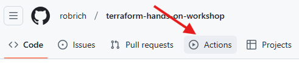
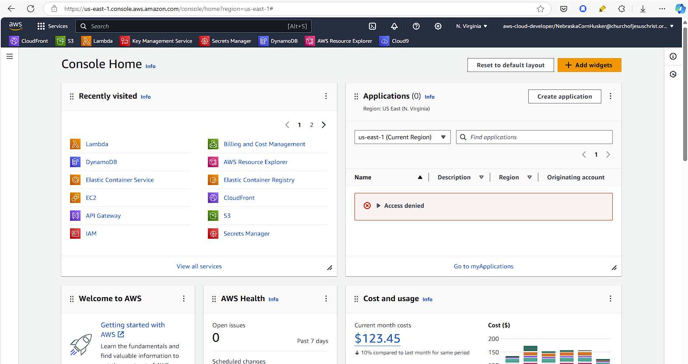

Installing Terraform and Machine Setup
======================================

> Welcome to the Terraform Hands-on Workshop!  We're excited you're here.  This starter chapter gets a few tools setup and ensure you have access to everything.


Introduction
------------

In this section we'll get these tools installed:

1. [Terraform](https://developer.hashicorp.com/terraform/tutorials/aws-get-started/install-cli)

2. [AWS CLI](https://docs.aws.amazon.com/cli/latest/userguide/getting-started-install.html)

3. Optional: [Node.js](https://nodejs.org/en/download/package-manager)

   1. Alternative recommendation for full-time developers - [Install NVM](https://github.com/nvm-sh/nvm?tab=readme-ov-file#installing-and-updating)

4. Optional: [Docker Desktop](https://www.docker.com/products/docker-desktop/) or another container build system.

We'll also ensure you can authenticate to:

1. [AWS CLI](https://docs.aws.amazon.com/cli/latest/userguide/cli-configure-sso.html)

2. [AWS "Console" Website](https://us-east-1.console.aws.amazon.com/)

3. [GitHub Actions](https://github.com/)


AWS Account Access
------------------

You'll need an AWS account where you have **root** access.  You need to be able to create and delete resources in AWS.  An Enterprise account where you only have read-only access or where you can only create certain resources may not work.

Options for your AWS account:

1. An AWS account provisioned by your employer.  Ensure you have access to create and delete all resources.

2. An [AWS Trial](https://aws.amazon.com/free/) account.  They give you access to create most things for 90 days.  The signup process requires a credit card to ensure you're a human, but they won't bill your card for items created during the trial.  Instead, they'll shut them off when the trial expires.

3. A personal AWS account.  You can sign up for a new [AWS account](https://signin.aws.amazon.com/signup?request_type=register) for this workshop.

With your chosen account, ensure you can login to the [AWS "console" website](https://us-east-1.console.aws.amazon.com/)


GitHub
------

1. [Create](https://github.com/signup) or [Login](https://github.com/login) to your GitHub Account.

2. Ensure you have access to [GitHub Actions](https://github.com/features/actions) by clicking on the Actions tab at the top of any repository in your account.

   

   **Note**: If this is a brand new account, you don't have any repositories, but I'm confident you have access if you're outside any organizations.


Install Terraform
-----------------

> [!WARNING]
> Though you may already have Terraform installed, it's important that you're using the latest version.  Please install the latest Terraform CLI version.

See also the official [Terraform install instructions](https://developer.hashicorp.com/terraform/tutorials/aws-get-started/install-cli)

Choose the option that matches your operating system and install preferences.

### Manual Install (Advanced)

1. Visit https://developer.hashicorp.com/terraform/install

2. Choose the download package appropriate for your OS.

3. After installing, ensure the Terraform CLI is in your `PATH`

### Windows Install

1. Use [Chocolatey](https://chocolatey.org/) to install Terraform on Windows:

   ```sh
   choco install terraform
   ```

### macOS Install

1. Use [Homebrew](https://brew.sh/) to install Terraform on macOS:

   ```sh
   brew tap hashicorp/tap
   brew install hashicorp/tap/terraform
   ```

### Linux Install

Follow the instruction in the [Official Terraform install instructions](https://developer.hashicorp.com/terraform/install)

### Verify - All OS

Once Terraform is installed, verify it works as expected:

1. Open a **new** terminal in any directory and run

   ```sh
   terraform --version
   ```

   You need a new terminal because the install may have updated your `PATH`, and existing terminals won't show this updated `PATH`.

If you see the current Terraform version, and it's the latest shown on https://developer.hashicorp.com/terraform/install then you have Terraform installed.


Login to AWS Website
--------------------

> [!IMPORTANT]
> You need to repeat this login process every day you want to use the AWS website.

> [!NOTE]
> AWS likes to call their cloud portal the "console".  This seems quite confusing.  "Console" typically means a CLI.  But in this case "console" means their website.

1. Visit https://console.aws.amazon.com/ in your preferred browser.

2. Login with your username and password.

3. You'll now see the AWS website with the AWS logo at the top-left.

   

### AWS via SSO

1. Visit your corporate SSO login portal

2. Click on the appropriate icon for AWS.

3. Login with the appripriate corporate credentials.

4. You'll now see the AWS website with the AWS logo at the top-left.

   

Congratulations!  You're now logged into the AWS website.  We won't do anything here yet.


AWS CLI Install
---------------

Terraform uses the underlying provider's APIs to provision resources.  On AWS, Terraform connects to the AWS CLI.  Let's get the AWS CLI installed.

> [!WARNING]
> Though you may already have the AWS CLI installed, it's important that you're using the latest version.  Please install the latest AWS CLI version.

> [!CAUTION]
> AWS CLI v1 will **not** work with this workshop.  You must uninstall v1 and install v2.

See also the official [AWS CLI Install Documentation](https://docs.aws.amazon.com/cli/latest/userguide/getting-started-install.html)

### Windows

1. Download and install https://awscli.amazonaws.com/AWSCLIV2.msi

### macOS

1. Download and install https://awscli.amazonaws.com/AWSCLIV2.pkg

### Linux

1. Open a terminal and run:

   ```sh
   curl "https://awscli.amazonaws.com/awscli-exe-linux-x86_64.zip" -o "awscliv2.zip"
   unzip awscliv2.zip
   sudo ./aws/install
   ```

### Verify - All OS

Once the AWS CLI is installed, verify it works as expected:

1. Open a **new** terminal in any directory and run

   ```sh
   aws --version
   ```

   You need a new terminal because the install may have updated your `PATH`, and existing terminals won't show this updated `PATH`.

If you see the current AWS version, and it's the latest shown on https://docs.aws.amazon.com/cli/latest/userguide/getting-started-install.html then you have the AWS CLI installed.


AWS CLI Login (without SSO)
---------------------------

Do you login to AWS through your employer's SSO (single-sign-on) provider such as Okta, Microsoft, or others?  If so, follow the SSO instructions below.  If not, use the regular instructions.

In this setup instructions, we'll use the profile name `training`.  You could use any profile name, but we'll stick with `training` for convenience.

> [!TIP]
> We'll login from any terminal in any directory.  Once logged in, you can use any other terminal running in any other directory.  AWS remembers you're still logged in.


### Direct Login

If you don't login through a single-sign-on provider, you can login directly to AWS.

See also the official [AWS CLI instructions](https://docs.aws.amazon.com/cli/latest/userguide/getting-started-quickstart.html)

1. If not already, login to the AWS website at https://aws.amazon.com/

2. In the very top-left, in the search box, type `IAM` and navigate to the Identity Access Management (IAM) page.

3. On the far-left, switch to the `Users` page.

4. From the list of users, click your user.

5. If there are no users or you don't find your user, go to the top-right and click `Create user`,

   - Leave the `Provide access to AWS Console` option unchecked (the default).

   - In the `Permissions Options`, choose `Attach policies directly`.

   - In the list, choose `AdministratorAccess`.

     **WARNING**: This is definitely not a security best practice, but this eliminates permission errors during this workshop.

   - Finish creating the user.

6. Now in the user's details page, on the top-right, choose `Create access key`.

   - `Use case` is `Command Line Interface (CLI)`

   - In the `Description` enter `terraform-training`

7. Copy or download the Access Key and Secret.

   **IMPORTANT**: These will only be shown once.  If you lose these keys, you must create a new one.

8. Open a terminal in any directory and run

   ```sh
   aws configure --profile training
   ```

   (You could pick a different name, but you'll use this session name in every chapter.  Best to keep this name for the workshop.)

9. When prompted, enter:

   - Access Key copied above

   - Secret Key copied above

   - Default region: pick a convenient region from https://docs.aws.amazon.com/AWSEC2/latest/UserGuide/using-regions-availability-zones.html such as `us-east-1`

   - Default output format: `json`

   **Note**: These config values get saved into `~/.aws/config` and `~/.aws/credentials`.  `~` represents your home directory.  On Windows this is `C:\Users\YOUR_NAME` and on Mac and Linux this is `/home/YOUR_NAME`.  You should back up the `.aws` directory.

3. Verify you're logged in correctly:

   ```sh
   aws sts get-caller-identity --profile training
   ```

   In the console output, ensure the `Account` is the account you expected.  If it isn't, return to the top of this section and try logging in again.

4. Export the current profile as an environment variable.

   In Mac and Linux:

   ```sh
   export AWS_PROFILE="training"
   ```

   In Windows PowerShell:

   ```powershell
   $env:AWS_PROFILE = "training"
   ```

   In Windows Command Prompt:

   ```sh
   set AWS_PROFILE=training
   ```

   **Pro-tip**: This is easier than passing in the profile to every AWS CLI command.

   **WARNING**: You'll need to re-export the `AWS_PROFILE` environment variable in each terminal.  If you close and re-open a shell, you'll need to re-run the above command.


### SSO

If your AWS account is through your employer and you need to login via SSO, you may already have this configured.

See also the official [AWS CLI SSO instructions](https://docs.aws.amazon.com/cli/latest/userguide/cli-configure-sso.html).

> [!TIP]
> We'll login from any terminal in any directory.  Once logged in, you can use any other terminal running in any other directory.  AWS remembers you're still logged in.

1. Open a terminal in any directory and run:

   ```sh
   aws configure sso --profile training
   ```

   This screen will prompt you with many details your employer needs to provide.  If you can't get these details, consider using a free trial AWS account.

   **Note**: These config vaules go into `~/.aws/config` and `~/.aws/credentials`.  `~` represents your home directory.  On Windows this is `C:\Users\YOUR_NAME` and on Mac and Linux this is `/home/YOUR_NAME`.  You should back up this directory.

2. Login with this terminal command:

   ```sh
   aws sso login --profile training
   ```

   **Note**: Though you only need to configure once, you'll need to repeat this login process every day.

3. Click each of the two Allow buttons in your browser.

4. Export the current profile as an environment variable.

   In Mac and Linux:

   ```sh
   export AWS_PROFILE="training"
   ```

   In Windows PowerShell:

   ```powershell
   $env:AWS_PROFILE = "training"
   ```

   In Windows Command Prompt:

   ```sh
   set AWS_PROFILE=training
   ```

   **Pro-tip**: This is easier than passing in the profile to every AWS CLI command.

   **WARNING**: You'll need to re-export the `AWS_PROFILE` environment variable in each terminal.  If you close and re-open a shell, you'll need to re-run the above command.

5. Run any AWS CLI command to verify you're logged in.

   From a terminal, run this:

   ```sh
   aws sts get-caller-identity
   ```

   In the console output, ensure the `Account` is the account you expected.  If it isn't, return to the top of this section and try logging in again.

Woo hoo!  Now that you're logged into the AWS CLI, Terraform can use it to provision resources for you too.


Optional: Node.js Install
-------------------------

The application we'll deploy is written in TypeScript, and the tester apps are written in JavaScript.  Though you don't need to know TypeScript nor JavaScript for this Terraform workshop, having Node.js installed may be helpful.  Without Node.js, you can use the browser to test some things, but won't be able to fully flex the system we'll build.

1. Visit https://nodejs.org/en/download/package-manager to download and install Node.js for your OS.

**Alternate install method**: [NVM](https://github.com/nvm-sh/nvm?tab=readme-ov-file#installing-and-updating) is the Node Version Manager.  It's a great way to install multiple versions of Node.js and easily switch between them.  If you're using NVM or another Node version switcher, ensure you're using the latest version of Node.js.


Optional: Docker Desktop Install
--------------------------------

We'll install a Docker container into Fargate (ECS) as part of this workshop.  You can use the [prebuilt container](https://hub.docker.com/r/robrich/terraform-workshop-aws) publicly available on Docker Hub, or you can install a container runtime such as Docker Desktop, Podman, Rancher Desktop, Minikube, etc.

If you'll choose to use the prebuilt container, you can skip this install.

### If you choose Docker Desktop

1. Consider the Docker Desktop [license restrictions](https://www.docker.com/pricing/).

2. Visit https://www.docker.com/products/docker-desktop/ to download and install Docker Desktop for your OS.

3. Reboot your computer.

4. Verify it works:

   Open a Terminal in any directory and run:

   ```sh
   docker --version
   ```

If it returns the current version as shown on https://docs.docker.com/desktop/release-notes/ then Docker is working as expected.

### If you choose Podman

1. Visit https://podman-desktop.io/downloads to download, install, and start Podman Desktop for your OS.

2. Reboot your computer.

3. Verify it works:

   Open a Terminal in any directory and run:

   ```sh
   docker --version
   ```

   **Note:** The command is `docker` even though the application is Podman Desktop

### If you choose Rancher Desktop

1. Visit https://docs.rancherdesktop.io/getting-started/installation/ to download, install, and start Rancher Desktop for your OS.

2. Reboot your computer.

3. Verify it works:

   Open a Terminal in any directory and run:

   ```sh
   docker --version
   ```

   **Note:** The command is `docker`.  Rancher Desktop installs the open-source components of Docker.  It does not install Docker Desktop, the licensed version.

### If you choose Minikube

1. Visit https://minikube.sigs.k8s.io/docs/start/ to download, install, and start Minikube for your OS.

   You'll also need to install a virtualization engine like VirtualBox, Hyper-V (Windows only), or HyperKit (macOS).

2. Install the open-source Docker Engine CLI.  This is the open-source bits of Docker, this is not Docker Desktop, the licensed version.

   Visit https://docs.docker.com/engine/install/binaries/ to download and install the version for your OS.

2. Reboot your computer.

3. Start Minikube from a terminal with this command:

   ```sh
   minikube start
   ```

4. Set the environment variables.

   From a terminal, run this command:

   ```sh
   minikube docker-env
   ```

   **Note:** This command returns environment variables that must be set to tell the Docker CLI to use the Minikube VM.

5. Copy and paste the environment variables and run them in the terminal window.

6. Verify it works:

   Open a Terminal in any directory and run:

   ```sh
   docker --version
   ```

> [!NOTE]
> You'll need to set these environment variables in each terminal window you start.  So if you close a terminal and re-open it, you'll need to re-run `minikube docker-env` and then run the supplied environment varialbes.


Conclusion
----------

Wow, that was a lot of setup.  Thankfully, that's the hardest part of this workshop.  Now that you've got everything all setup, you're ready.  We look forward to seeing you on the day where we'll learn Terraform together.  I can't wait!
