Click-Ops
=========

> [!NOTE]
> Find anything missing or inaccurate?  Show me, and let's get it added to the courseware.

Introduction
------------

Our goal in this section is to:

1. **Temporally** provision AWS Infrastructure

2. Learn about AWS architecture and the parameters for each resource

> [!CAUTION]
> When you're done with this chapter, ensure you delete all resources created in this chapter.  (See the last step below.)  Running AWS resources longer than necessary is expensive.

Manually clicking through websites to provision resources is often called **"Click-Ops"** because it's a process typically done by the Operations team.  Unlike "DevOps" or "SecOps" or other automation techniques, this is a very manual process.  So the term "Click-Ops" is usually meant as a derogatory term.  **Click-ops is not a best practice**, but we'll learn a lot about the AWS resources through this chapter.

Architecture Diagram
--------------------

In this section, we'll manually provision AWS architecture to connect a user to data in a database through both a Lambda and a Container.  Here's the Architecture diagram we'll provision:

Login to AWS Website
--------------------

1. In Chapter 0: Machine Setup, we noted that you'll need to login to the website each day.  Today is the day!  Return to [Chapter 0: Machine Setup, Login to AWS Website](../00-Machine-Setup#login-to-aws-website) section and get logged in.

2. Ensure you're in your chosen region.  Look at the top-right of the AWS website and change the region if necessary.

DynamoDB
--------

In this section, we'll provision an AWS [DynamoDB](https://aws.amazon.com/pm/dynamodb/).

DynamoDB is a key/value database similar to Redis where given the primary key, we can select a JSON document.  Unlike Redis, and more like MongoDB and other Document databases, we can have columns for each property in a JSON object.  Unlike MongoDB and CosmosDB and other document databases, we can't query by these other columns, but rather only by the primary key and sort key.

The beauty of DynamoDB is it's a really cost-effective, globally scalable database.

DynamoDB will be the data store in our cloud architecture.  Here's the full diagram:

1. In the top-left, in the search bar, type `dynamodb` and choose "DynamoDB" from the list.

2. In the menu on the left, choose Tables.

3. On the right, click `Create Table` button.

4. Enter a unique table name.  Include content such as your name, your project name, the environment, or other details.  Note that you can't include spaces.  It's best practice to use all lower-case letters and underscores.

5. For the Partition Key name, enter `pk` and choose type `string`.

   **Note:** In a production app, you'd probably use much more descriptive attribute names here.  We're using `pk` and `sk` for simplicity.  The tester app we'll run at the end uses this convention.

6. For the Sort Key name, enter `sk` and choose type `string`.

   **Tip:** A sort key is not required for a DynamoDB table, but it's a good idea to have one.

   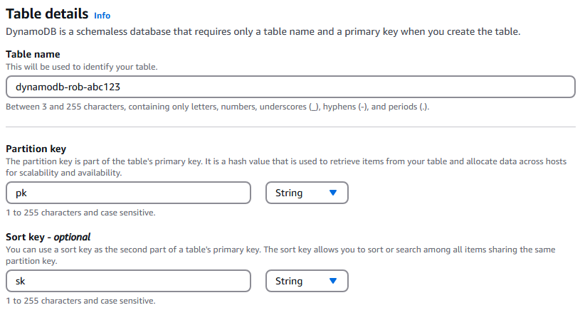

7. Click `Customize Settings` to open optional settings.

   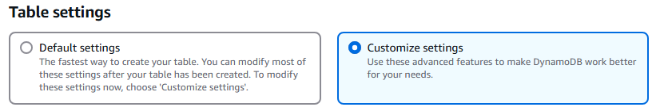

8. In the `Read/write capacity` settings section, set the capacity mode to `On-Demand`.

   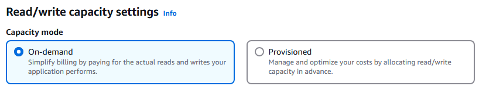

9. In the Tags section:

   a. click `Add a new tag`
   b. In the name field type in `project`
   c. In the value field type in your name

   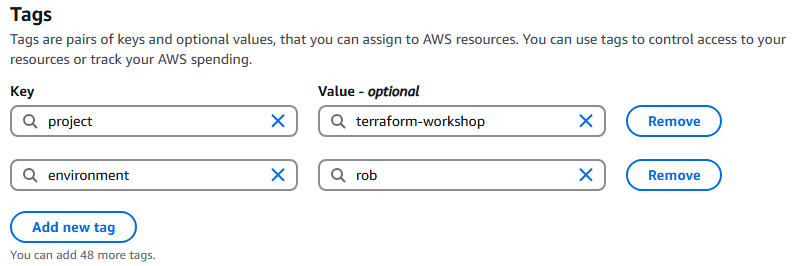

10. In the Tags section, click `Add new tag`, then in the name field type `environment`, and in the value type your name again.

11. Optional: Add additional tags to specify other details about this resource such as:

    - responsible party
    - department
    - project name

    **Pro Tip:** Tags are a great way for users to identify or search for cloud resources. Adding more tags can help make your cloud resources easier to discover and track.

12. At the bottom of the screen, click the `Create Table` button.

    Are there any errors in the settings?  If so, notice the red errors and adjust values to correct these concerns.

13. Once the DynamoDB is provisioned, on the far left menu, click `tables` and choose the DynamoDB table you just created from the list.

14. Look through the details on this screen including the tabs showing additional configuration details.

15. Click the `Explore table items` button.  Choose `Scan` and click the `Run`.

    **Pro tip:** It's generally significantly cheaper to Query than to Scan.  Scan reads every record in the table from disk, and charges you for each record read.  In this case we only used 2 credits to determine the table was empty.  Imagine a table with a million rows.  Scan gets expensive really fast.

16. Note that there is no data in the table.  Makes sense, we just provisioned an empty table.

    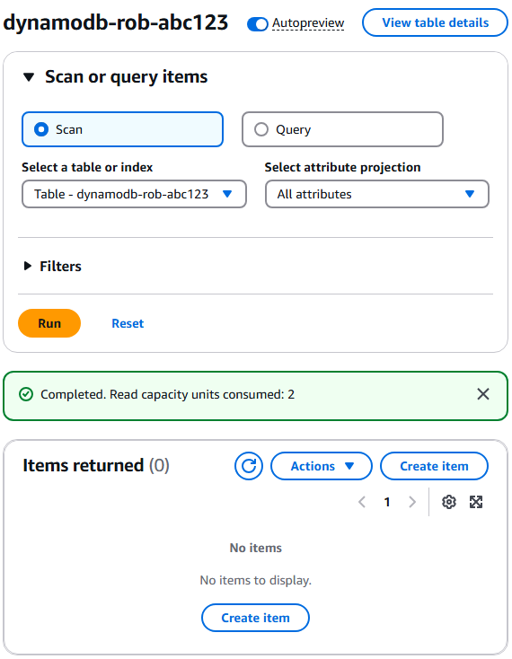

Congratulations!  You just provisioned a DynamoDB table.  Next, let's build a Lambda function that reads from this table.

Lambda Function
---------------

In this section, we'll provision a Lambda function together with it's required dependencies.

An AWS [Lambda Function](https://aws.amazon.com/pm/lambda/) is a single public function (that may call other private functions) that can be easily elastically scaled in the cloud.  Depending on the code language, you may be able to write the entire thing in the AWS website.

In this section we'll take the lambda zip we built in Chapter 2: Apps and deploy it into AWS.

The Lambda is part of our cloud-native solution.  Here's the full architecture:

1. In the AWS Website, in the top-left, search for `Lambda` and choose Lambda.

2. In the far left menu choose `Functions`.

3. On the right, click `Create function`.

4. Choose `Author from Scratch`, the default.

   The other options are interesting, but add additional complexity to our function.  We'll skip that complexity for now.

5. Enter a descriptive function name.  Add your name to make it easy to find later.

   **Tip:** Lambda names can only include letters, numbers, and underscores. No ~~spaces~~, ~~special characters~~, or ~~emoji~~. ☹️  Best practice is to only use lower-case letters, numbers, and underscores, avoiding upper-case letters.

   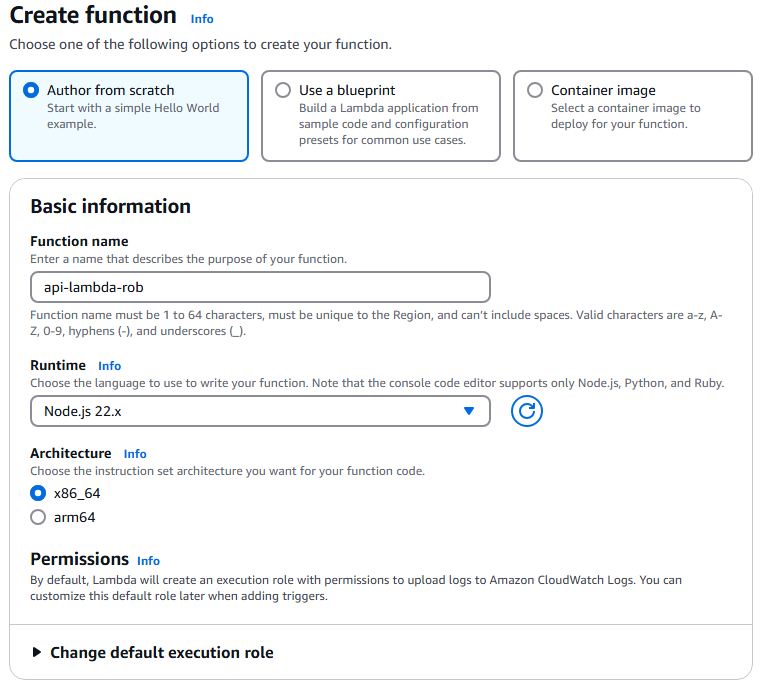

6. Set the Runtime to `Node.js 22.x`.

   Are you from the future?  If there's a later version of Node.js, use that instead.

7. Set the Architecture to `x86`.

8. On the bottom-right, click `Create function`.

   **Note:** We haven't finished provisioning the function, but these are all the parameters we can set before creating the function.

9. Once the function is created, switch to the `Code` tab if not already there.

   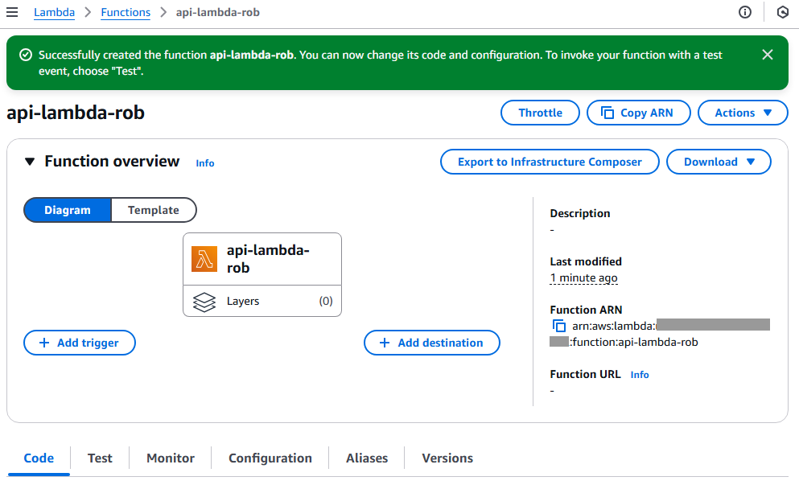

10. On the far right, in the `Upload from` menu, choose `.zip file`.

    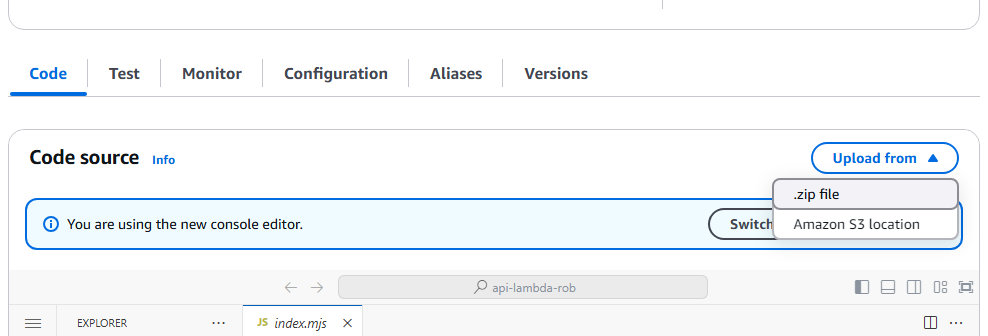

11. From the `02-Apps` folder, choose `terraform-lamdba.zip`.

    **Note:** Maximum upload size is [50 megs](https://docs.aws.amazon.com/lambda/latest/dg/gettingstarted-limits.html#function-configuration-deployment-and-execution).  If you need a zip file bigger than this, you need to first upload it to an S3 bucket and link it to the Lambda.

12. Switch to the `Configuration` tab, then to the `Environment Variables` page.

    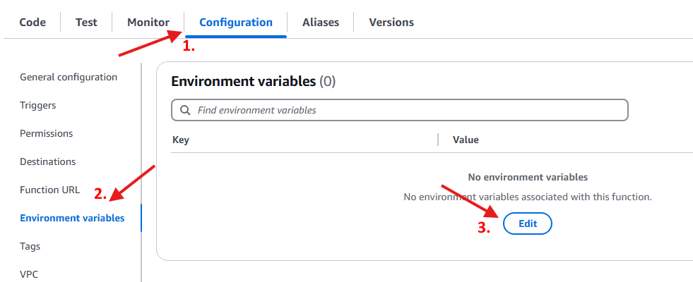

13. In the middle of the screen, click the `edit` button.

14. In the new window, click `Add environment variable`.

15. The `key` is `DYNAMODB_TABLE`, and the value is the DynamoDB table name created previously.

    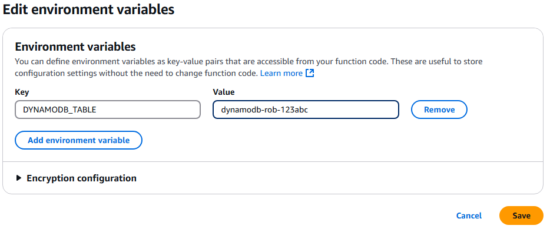

16. On the bottom-right, click `Save`.

17. Switch to the `Code` tab, scroll down to `Runtime settings`, and select the `Edit` button on the right.

18. Change `Handler` to `app.dynamoDbQueryHandler`.

    The handler is the function name in the source code.  See 02-Apps/lambda/app.ts and 02-Apps/lambda/src/routes/lambda-handler.ts.

    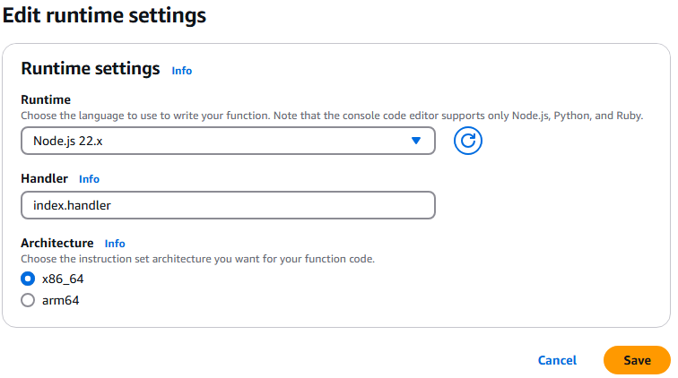

19. On the bottom-right, click the `Save` button to apply the new handler name.

20. We need to give the Lambda permission to query the DynamoDB.  To do this, we'll create an IAM Policy and attach it to the role generated for the Lambda.

    In the top-left, in the search bar, type `IAM`.

21. On the far left, switch to the `Policies` page.

    Yes, we could use an existing policy like [`AmazonDynamoDBFullAccess`](https://docs.aws.amazon.com/aws-managed-policy/latest/reference/AmazonDynamoDBFullAccess.html), but best practice is to use "least privilege", only the bare minimum access necessary.

22. On the top-right, click the `Create policy` button.

23. In the Select a Service section, in the `Choose a service` section, type `dynamodb` then pick "DynamoDB".

    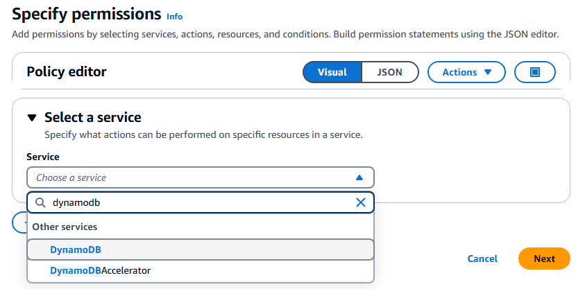

24. On the far right, choose `Allow`.

25. Open the Read section, and select:

    - BatchGetItem
    - ConditionCheckItem
    - DescribeTable
    - GetItem
    - Query
    - Scan

26. Open the Write section, and select:

    - BatchWriteItem
    - DeleteItem
    - PutItem
    - UpdateItem

    Why did we choose this permission list?  These are all the functions the Lambda and Container app will perform in DynamoDB.  Yes, the Lambda probably only does some of these, so we could shorten the list even further.

27. Scroll down to the `Resources` section, and click `Specific`.

28. In the `Table` section, click `Add ARNs`.

29. Enter the DynamoDB's `region` and the `table name` to match the DynamoDB.

    In the Table Name box, add `/*` to the end.  We want to make sure we get not only the table, but the table contents too.

    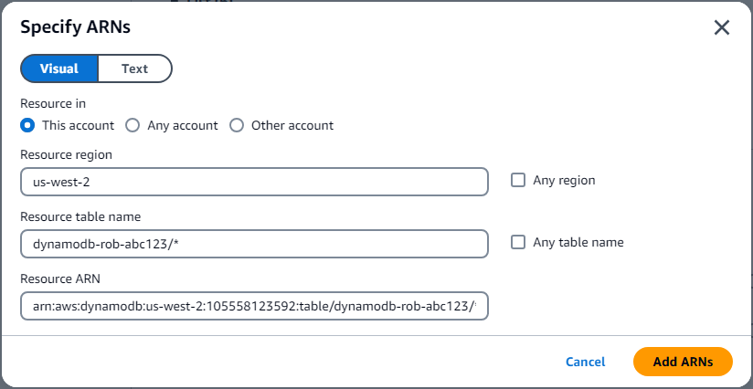

30. On the bottom-right, click the `Add` button.

31. On the bottom-right, click the `Next` button, then click the `Previous` button.

32. On the top-left, switch from Visual to `JSON`.

    This is the text representation of the policy we created.  Note that it says `Allow`, lists the full ARN (Amazon Resource Name) of the DynamoDB, and the list of permissions we selected above.  In time, it'll be handy to learn to write these policies directly.

33. On the bottom-right, click `Next`.

34. In the Policy Details section, enter a `Policy Name` to match the Lambda such as `api-lambda-policy`.

35. On the bottom-right, click `Create Policy`.

    Success!  We created the policy!  Now let's attach the policy to the role.

36. In the top-left, in the search box, type `Lambda` and select the "Lambda" service.

37. On the far left, choose Functions.

38. Choose the Lambda from the list.

    **Note:** Is your function missing from the list?  Double-check you're in the right region.  Go to the very top-right, and change your region from the list of locations.

39. Click on `Configuration` then on the left choose `Permissions`.

40. In the `Execution role` section, click on the `Role name` to switch to the IAM page.

    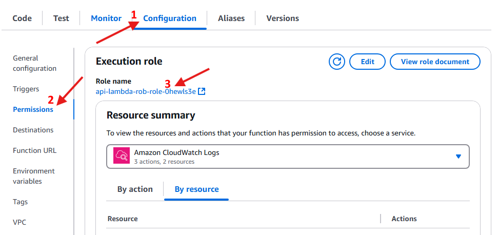

41. In the Role page, in the `Permissions policies` section, open the `Add permissions` menu and choose `Attach policy`.

    

42. In the Policy page, in the Search box, type the name of the policy created above.

43. On the far-left, check the box to select the correct policy

44. On the bottom-right, click the `Add permissions` button.

45. Let's verify the policy is attached to the Lambda.

    In the very top-left search box, type `Lambda`, and select the Lambda service, on the left choose `Functions`, and select your function from the list.

46. Choose your function from the list.

    **Note:** Do you need to change regions?  Look at the top-right.

47. In the middle of the page, switch to the `Configuration` tab, then in the left menu, switch to the `Permissions` tab.

    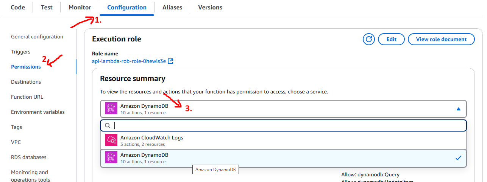

48. In the Resource summary section, click on `Cloudwatch Logs` and switch to `DynamoDB`.

49. Note all the permissions we selected previously, and the full ARN to the DynamoDB table.

50. Let's test the Lambda function.

    Switch to the `Test` tab.

    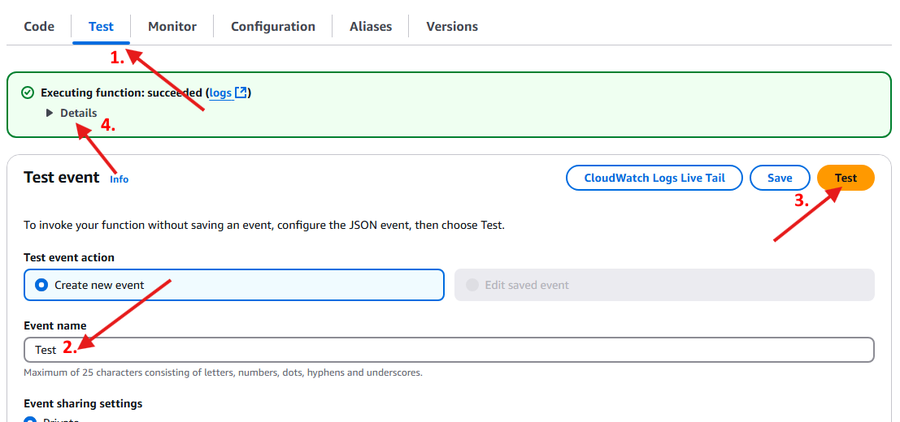

51. Enter a name for the test such as `test`.

    Yes, we could set other POST body details or query string details, but we'll leave the defaults for now.

52. On the right of the Test event section, click `test`.

53. Did the Lambda succeed?  Open up the test result details to see.

    **Note:** There's no data in the database, so we'll likely get an HTTP 200, and in the JSON response, an empty `data` section and `"valid":false`.

    **Tip:** Did you get a permission error?  Double-check the Lambda is assigned to the role, the role is assigned to the policy, and the policy has both the correct permissions, and the correct DynamoDB table ARN followed by `/*`.

API Gateway
-----------

In this section, we'll provision an API Gateway to sit in front of the Lambda function.

An [API Gateway](https://aws.amazon.com/api-gateway/) has a lot of pieces.  Thankfully the wizard provisions most of them for us.

Here's the Architecture diagram showing the API Gateway exploded view:

1. In the AWS Website, in the top-left, search for `API Gateway` and choose API Gateway.

2. In the far left menu choose `APIs` if you're not there already.

3. On the top-right, click `Create API`.

4. On the right, find the HTTP API section and click `Build`.

5. Click the `Add integration` button.

6. In drop-down, choose `Lambda` from the list.

7. In the Lambda function section, choose your Lambda created above.

   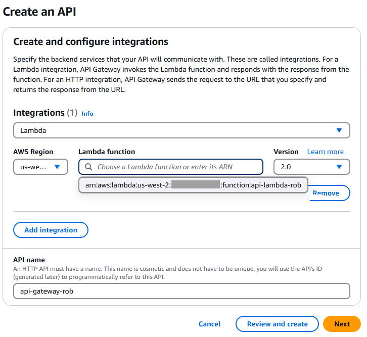

8. Enter a descriptive name.  Add your name to make it easy to find later.

   **Tip:** API Gateway names can include any characters, but it's best practice to only use lower-case letters, numbers, and underscores, avoiding ~~spaces~~, ~~upper-case letters~~, ~~special characters~~, and ~~emoji~~.

9. Click `Next` to configure routes.

10. In the `Configure Routes section`, set the following parameters:

    - Set `Method` to `GET`
    - Set `Resource Path` to `/api`

    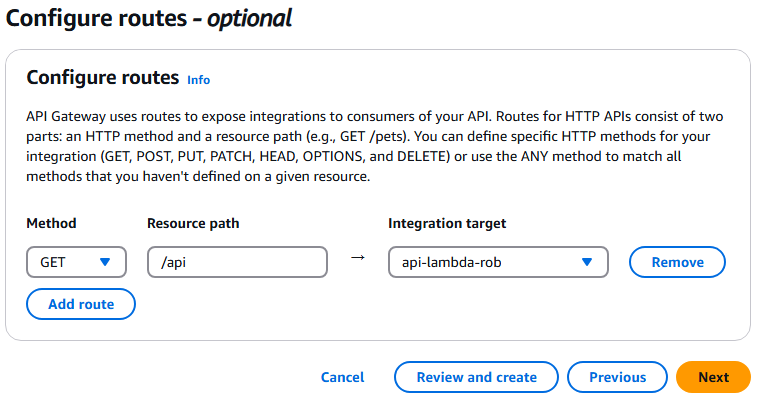

11. Click `Next` to configure stages.

12. Leave the Stages settings with the defaults.

    **Tip:** This magic `$default` stage auto-deploys any changes.  This removes another button to click any time you make a change to the API Gateway configuration.

13. Click `Next` to review and create.

14. Click the `Create` button.

15. This wizard did a lot of magic for us.  Let's take a look at the Lambda and see the configuration it put in place.

    Use the search box in the top-left to switch to Lambda, and open your Lambda function.

16. Note the API Gateway trigger in the diagram at the top.

    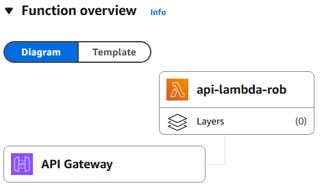

17. In the middle, switch to the `Configuration` tab then the `Triggers` page.

    Note the API Gateway trigger.

18. Open the `Details` tab and look at all the API Gateway configuration details.

    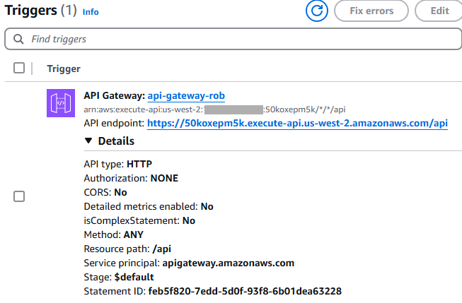

19. In the `Configuration` tab, switch to the `Permissions` page on the left.

20. Scroll down to the `Resource-based policy statements` section and click `View policy`.

    Note that the new policy that allows API Gateway has permission to execute the Lambda.

21. Now let's examine some of the pieces auto-generated in API Gateway.

    Using the Search bar on the top-left, switch to `API Gateway` and select your gateway.

22. On the left, in the `Develop` section, click through each of the tabs:

    - Routes
    - Integrations

    Note: We didn't configure Authorization.  In production, we likely want an authorizer lambda.

    Note: We also didn't configure CORS.  If a React or Vue app connected from a different domain or sub-domain, we'd need to configure it here.

23. In the `Deploy` section switch to the `Stages` page.

24. In the center, select the `$default` stage.

    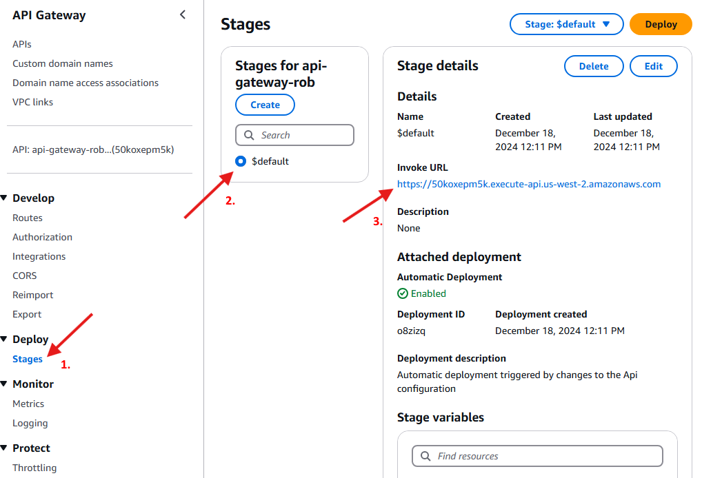

Testing API Gateway, Lambda, and DynamoDB
-----------------------------------------

Let's test the API Gateway, the Lambda, and the DynamoDB setup.

1. Switch to API Gateway and select the API Gateway you created.

2. In the `Deploy` section switch to the `Stages` page.

3. In the center, select the `$default` stage.

   

4. Copy the `Invoke URL`.

5. Open a new browser window.

6. Paste the `Invoke URL` and add `/api` to the end.

7. Hit enter to execute the page.

Success!  If you got a empty `data` section and `"valid":false`, it works!  We've validated the API Gateway, the Lambda, and the DynamoDB connection.  We get an empty `data` section because DynamoDB doesn't have any data yet.

Did it fail?  The error message will likely tell you a lot more.  But here's some things to try:

- Check the policies for both the API Gateway and the Lambda.
- Check the Lambda environment variable pointing to the DynamoDB table name.
- Check that you're using the Stage Invoke URL and not the Default Endpoint.

Vibe Check
----------

Are you tired of doing click-ops and want to get to the Terraform?  Feel free to skip the container side of the architecture diagram, jump straight to the [Destroy](#important-destroy-the-infrastructure) section at the bottom, and onto Chapter 4: AWS Terraform.  Though we're learning a lot about AWS Services, we're not learning about Terraform yet.

Fargate and ECS (Elastic Container Service)
-------------------------------------------

In Chapter 2: Apps, we built (or probably referenced an existing) container image.  In this section we'll provision ECS (Elastic Container Service) in [Fargate](https://aws.amazon.com/fargate/) mode.  Though we could directly provision EKS (AWS's Kubernetes) or ECS (AWS's home-grown container orchestrator), Fargate sits over top and abstracts and simplifies the experience.  The other option is to provision EC2 VMs.

To create an ECS cluster is quite involved.  We need a task (think k8s pod), a service (think k8s deployment, service, and ingress), and the cluster itself.  Within the container setup, we need environment variables and a policy to connect to DynamoDB.  This is quite involved.

Here's the Fargate architecture we'll build:

### Fargate Cluster

1. In the AWS Website, in the top-left, search for `ECS` and choose "Elastic Container Service".

   **Note:** If you search for "Fargate", you won't find it in the list.  Instead you will find `Elastic Container Service` (ECS).  Fargate is an abstraction over ECS or EKS, and not a unique service itself.

2. On the far-left, choose the `Clusters` page.

3. On the top-right, click `Create cluster`.

4. In the `Cluster configuration` section, set the `Cluster name` to a descriptive name.  Include your name so it'll be easy to find.

   **Best practice:** It's best to name all resources using only use lower-case letters, numbers, and underscores.  Avoid ~~spaces~~, ~~upper-case letters~~, ~~special characters~~, and ~~emoji~~ as some services don't like unusual names.  Even if the service you're using does support these characters, other services referencing this name may not.

5. In the Infrastructure section, select `AWS Fargate (serverless)` as the cluster type.

6. Optional: Open the Tags section and add tags to describe the resource:

    - responsible party
    - department
    - project name

    **Pro Tip:** Tags are a great way for users to identify or search for cloud resources. Adding more tags can help make your cloud resources easier to discover and track.

7. On the bottom-right, click `Create`.

### IAM Policy

We'll need a role with a policy that has access to DynamoDB to run the container.  We'll pick the policy in the role dialog, and the role in the task definition, so let's create the policy then role then task definition.

1. In the AWS Website, in the top-left, search for `IAM` and choose "IAM: Manage access to AWS resources"

2. On the far left, switch to the `Policies` page.

3. On the top-right, click `Create policy`.

4. In the `Select a service` section, in the Service list, choose `DynamoDB`.

5. In the `Actions allowed` section, on the far right, choose `Allow`.

6. Also in the `Actions Allowed` section, choose these items:

   a. Read:

      - BatchGetItem
      - ConditionCheckItem
      - DescribeTable
      - GetItem
      - Query
      - Scan

    b. Write:

       - BatchWriteItem
       - DeleteItem
       - PutItem
       - UpdateItem

   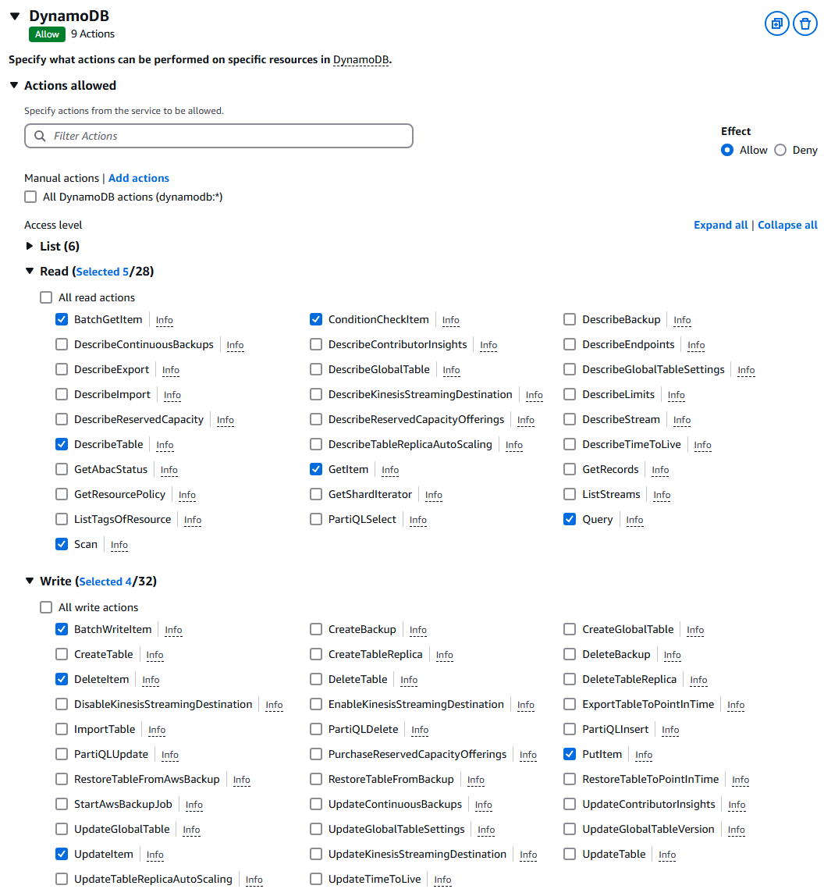

   We could probably choose a few less permissions here, but this list is a good start for many applications using DynamoDB.

7. In the `DynamoDB` section below the `Actions Allowed` list, in the `Resources` section, choose `Specific`.

8. In the `table` list, click `Add ARNs`.

   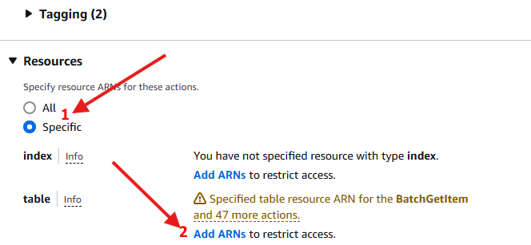

9. Select `This account` then enter your DynamoDB's `region` and `table name`.

   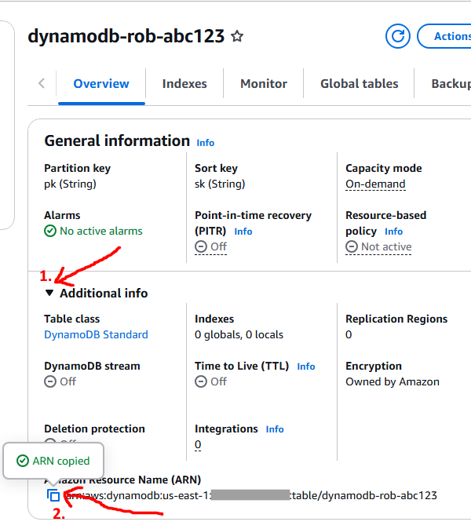

   Hint: You can open a new tab, switch to the DynamoDB service, choose your table, open the Additional info, and copy the `Amazon Resource Name` then switch back to this Policy page, and paste it into the `Resource ARN` box.

   

10. Click the `Add ARN` button.

11. Back in the Policy page, on the bottom-right, click `Next`.

12. In the `Policy details` section, give the policy a descriptive name such as `fargate-task-policy-rob`.

13. On the bottom-right, click `Create policy`.

14. In the list of policies, change `Filter by Type` to `Customer Managed`, and we can now see our new policy.

### IAM Role

Now that we have a policy that allows us to take action on our DynamoDB table, let's build a role that uses this task, and attach it to the ECS service's task definition.  Then when our container starts up, it has access to DynamoDB.

1. In the AWS Website, in the top-left, search for `IAM` and choose "IAM: Manage access to AWS resources"

2. On the far left, switch to the `Roles` page.

3. On the top-right, click `Create Role`.

4. In the `Trust entity type` section choose `AWS service` (the default).

5. In the `Use case` section choose `Elastic Container Service` from the list then choose `Elastic Container Service Task`.

   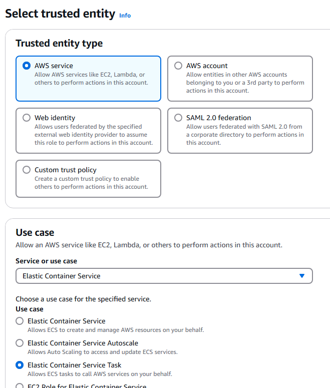

6. On the bottom-right, click `Next`.

7. In the `Permissions policies` section, change the `Filter by Type` to `Customer managed`.  The list is much, much shorter now.

8. Choose the policy created above by clicking the check-box to the left of it.

   

9. On the bottom-right, click `Next`.

10. Give the role a descriptive name such as `fargate-task-role-rob`.

11. Scroll down, and on the bottom-right, click `Create role`.

### ECS Task Definition

Wow, that was a long way to go to create a role and policy.  Let's create a task definition -- a container definition -- and attach the role to it.  If you're familiar with Kubernetes, this task definition is very similar to a Pod defined in YAML.

1. In the AWS Website, in the top-left, search for `ECS` and choose "Elastic Container Service".

   **Note:** If you search for "Fargate", you won't find it in the list.  Instead you will find `Elastic Container Service` (ECS).  Fargate is an abstraction over ECS or EKS, and not a unique service itself.

2. On the far-left, switch to the `Task definition` page.

3. Click the `Create new task definition` button, and choose `Create new task definition` option in the drop-down.  (We won't use JSON in this case.)

4. In the `Task definition configuration` section, give the task a descriptive name.  Add your name to make it unique.

5. In the Infrastructure requirements section, set necessary parameters:

   - Set the `Launch type` to `AWS Fargate` (the default)
   - Set the `CPU` to `.25 vCPU`
   - Set `Memory` to `.5 GB`
   - Set the **`Task role`** (not ~~Task execution role~~) to the Fargate role created above.

   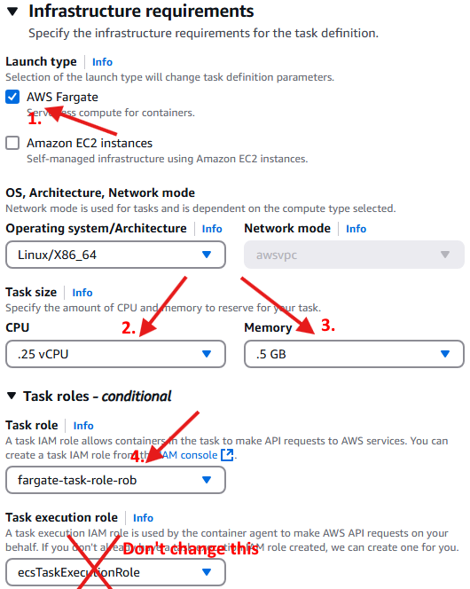

6. In the Container section, set necessary parameters:

   - Set `Name` to something descriptive
   - Set the `Image URI` to `robrich/terraform-workshop-aws:latest`
   - Set the `Container port` to 3000
   - Set the `Port name` to `http`

   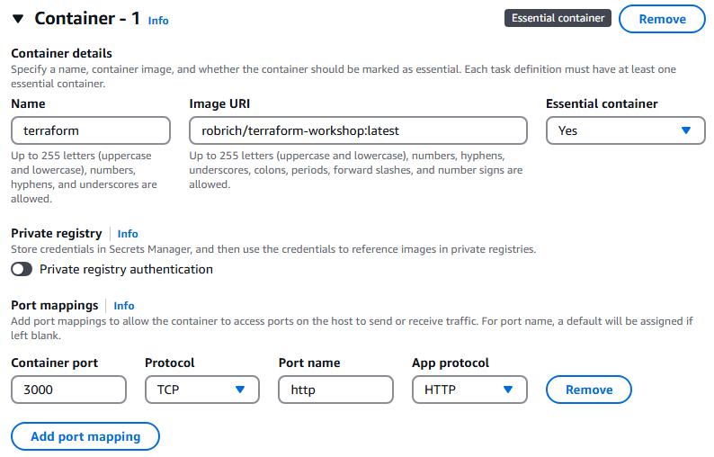

7. Still in the Container section, set Environment variables:

   - `DYNAMODB_TABLE` to match the DynamoDB table name created above
   - `NODE_PORT` = `3000`
   - `NODE_ENV` = your name

   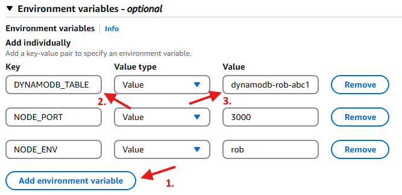

8. Still in the Container section, open `Logging` and uncheck `Use log collection`.

   The container doesn't have permission to write to CloudWatch, so with logs enabled, the deployment would fail.

   **Best Practice**: In a real scenario we definitely want logs.  So we'd leave this check-box checked, and add CloudWatch write permissions to the IAM policy instead.

9. Optional: Scroll down and open the Tags section and add many descriptive tags.

   **Pro Tip:** You can search AWS resources for matching tags.  This can be a great way to discover resources.  Once you find a resource, open the tags to learn more about who to contact or what version of the software is deployed.

10. Scroll all the way to the bottom of the page and click `Create`.

### ECS Service

We've created a container definition.  Now we need to create a service to run the container in the cluster.  If you're familiar with Kubernetes, this is similar to a Deployment.

1. In the AWS Website, in the top-left, search for `ECS` and choose "Elastic Container Service".

2. On the far left, switch to the `Clusters` page.

3. Choose your cluster from the list.

4. Scroll down and click `Services` to switch to the Services list.

5. Click the `Create` button.

   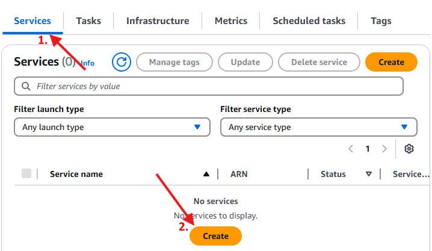

6. In the `Compute configuration` section, change the `Launch type` to `FARGATE`.

7. In the `Deployment configuration` section, and set these settings:

   - In the `Task definition` section, select the task created above.
   - Set the `Service name` to a descriptive name.
   - Leave the `Desired tasks` (count) to 1.

   Note: In production scenarios we'd want at least 3 to ensure high availability of this service.

8. Optional: Open the `Networking` section and adjust VPC, subnets, and security groups.

   Note: You don't want to select public subnets as the load balancer we'll create next will be the internet gateway into the cluster.

9. Open the `Load balancing` section, and set these settings:

   - Set `Load balancer type` to `Application Load Balancer`
   - Set `Application Load Balancer` to `Create a new load balancer`
   - Set the load balancer name to something descriptive and unique

   Admire the other default parameters set here by the wizard.  No other Load balancing parameters need adjustment.

10. Scroll down to the very bottom, and on the bottom-right click `Create`.

In a few minutes, the service definition will be complete.

### Fargate Task Instance

Now that we have an ECS cluster, a Task Definition (pod), and Service Definition, we can create a task definition.

1. In the AWS Website, in the top-left, search for `ECS` and choose "Elastic Container Service".

2. On the far left, switch to the `Clusters` page.

3. Choose your cluster from the list.

4. Scroll down and click `Tasks` to switch to the Tasks list.

5. The service should have automatically created a task.  Look at the task status to ensure it is `Running`.

Testing the Container
---------------------

Let's switch over to the Application Load Balancer to get the public URL to this container.

1. In the top-left, search for 'EC2' and switch to the `EC2` service.

   Load Balancers are in the "EC2" group of services, so if you search for ~~`ALB`~~, you won't find a match.

2. On the far left, scroll down to `Load Balancers` and switch to the `Load Balancers` page.

3. Select your load balancer from the list.

4. Find the DNS name for this load balancer.

5. Open a new browser tab, and navigate to this DNS name.

Congratulations!  You've deployed a container in AWS!

**IMPORTANT**: Destroy the infrastructure
-----------------------------------------

> [!CAUTION]
> It is **very** important to delete all the resources created today.  AWS **continues to charge** your account as long as these resources are running.  Ensure you've deleted all resources at the end of this chapter to save yourself money.  The next chapter also assumes you're starting without these resources provisioned.  Let's delete all the resources.

0. In the top-right, check that you're in the correct region -- the region you used today.

   **Note**: If you switch to a new region, the list will appear empty.  This doesn't mean there aren't any resources, but merely that there aren't any resources in this region.

   **Note**: You can use the `Tag Editor` to query for all resources in all regions.  We'll do this at the end.  Note that there's a lot of default resources provisioned in your account, so this list may be difficult to wade through.

1. In the top-left, in the search bar, type `API Gateway` and switch to the API Gateway service.

2. Click the radio button to the left of the API Gateway you created above.

   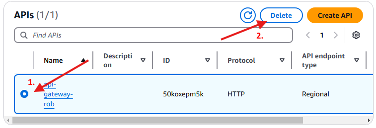

3. Click the Delete button.

4. Type `confirm` and click the `Delete button`.

5. This nicely deletes the stages, deployments, and API Gateway policies.

6. In the top-left, in the search bar, type `Lambda` and switch to the Lambda service.

7. Click the check-box next to the Lambda you created above.

   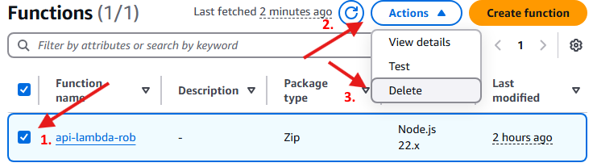

8. On the top-right, open the `Actions` menu and choose `Delete`.

9. Type `confirm` and click the `Delete button`.

10. This nicely deletes the integrations, policies, environment variables, and zip file.

11. Switch to the `DynamoDB` section, and on the far-left choose the `Tables` page.

12. Click the check-box next to the DynamoDB table you created above.

13. Click the `Delete` button.

14. Double- and tripple-check that you're deleting the correct table.

    **WARNING:** We're about to permanently delete data.  If you choose the DynamoDB table created above, all will be well.  If you choose a production database, it could become a resume-generating event.  Choose wisely.

15. Choose to delete all `CloudWatch alarms` and don't create an ~~on-demand backup~~.

16. Type `confirm` and click the `Delete` button.

17. This nicely deletes the table and all the data in it.

18. In the top-left, in the search bar, type `EC2` and open the EC2 section.

19. On the far-left, scroll down and switch to the `Load Balancers` page.

20. In the list, click on your load balancer to navigate to the load balancer's details page.

21. In the top-right, in the `Actions` menu, choose `Delete load balancer`.

22. Type `confirm` and click the `Delete` button.

23. In the top-left, in the search bar, type `ECS` and open Elastic Container Service.

24. On the far left, click on `Clusters`.

25. Click into the ECS cluster created above.

26. Switch to the `Tasks` tab.

27. In the `Tasks` menu choose `Stop all tasks`.

28. Type `stop all tasks` and press the `Stop all` button.

29. Back in the cluster's details page, switch to the `Services` tab.

30. Select the service created above.

31. On the top-right, click the `Update service` button.

32. Change `Desired tasks` (container counts) to 0.

33. Scroll down and on the bottom-right, click `Update`.

34. Back on the service page, on the top-right, click the `Delete service` button.

35. Type `delete` and press the `Delete` button.

36. Back in the cluster detail page, on the top-right, click `Delete cluster`.

37. Type the delete words and click the `Delete` button.

    **Warning**: You can only delete a cluster when no tasks are running.  If the cluster fails to delete, ensure no tasks are running and all services are deleted.

    **Note**: This deletes the cluster, but doesn't delete the task definition or namespaces.

38. On the far-right, click on `Clusters` and ensure the cluster list no longer contains your cluster.

39. On the far-right, switch to the `Task definitions` page.

40. Select the task definition created above.

41. Select all the task definition revisions (there's likely only one) and in the `Actions` menu choose `Deregister` and click the `Deregister` button.

42. Select all the task definition revisions again, and in the `Actions` menu choose `Delete` and click the `Delete` button.

43. On the far-left, click on `Task definitions` and ensure your task definition list is now empty.

44. On the far-left switch to the `Namespaces` page.

45. Click on the namespace to open it.

46. On the top-right, click `Delete`.

47. Deleting the VPC:

    If you did not have a VPC in your account when you began today, let's delete it.

    If you're in a corporate account with a previously setup VPC, skip these steps.

    **WARNING**: Deleting the default VPC isn't necessary, though it doesn't hurt anything.  If you want to use EC2 in this region later, you'll first need to recreate the default VPC.  A VPC is created in each region automatically.  See https://docs.aws.amazon.com/vpc/latest/userguide/default-vpc.html

48. In the top-left, search for `VPC` and switch to the `VPC` page.

49. On the far-left, click on `Your VPCs`.

50. Select the VPC in the list.

51. On the top-right, in the `Actions` menu, choose `Delete VPC`.

52. Click the `I acknowledge` button, type the specified text, and click the `Delete` button.

53. On the far-left, click through the other options in the `Virtual Private Cloud` section and ensure all the resource lists are empty.

    **Note**: You may need to click the refresh button (the arrow in a circle) on the top-right.

54. On the top-left, search for `IAM` and switch to the `IAM` section.

55. On the far-left, switch to the `Roles` page.

56. Select all roles created today including the roles that got auto-generated.

57. Type `delete` and click the `Delete` button.

58. On the far-left, switch to the `Policies` page.

59. Switch the `Filter by Type` menu to `Customer managed`.

60. For each policy created today (including auto-generated policies):

    - Select the policy
    - On the top-right, click the `Delete` button.
    - Type the necessary text and click `Delete`.

    **WARNING**: Don't delete any of the built-in roles, only delete customer-managed roles.

61. Now let's double-check everything is deleted.

    On the very top-left, search for `Tag Editor` and switch to the `Tag Editor` service.

62. Remove the current region and pick `All Regions` from the list.

63. Set `Resource Types` to `All supported resource types`.

64. Click `Search resources`.

65. Review the list of resources in the list and if needed delete these items too.

Did we delete everything?  You may want to redo this section to ensure everything is deleted.  Sadly, the only true way to verify everything is deleted is to check your AWS bill tomorrow or next week.

Summary
-------

In this module we learned a lot about how to provision resources in AWS.

We provisioned:

- DynamoDB
- A Lambda function
- An API Gateway that routes to the Lambda
- A container in Fargate (ECS)
- An ALB that routes to the container
- All the networking needed to create a VPC for ECS

That's a lot!  Well done you.

When we do this with Terraform, we'll set all the same parameters and options.  But unlike this click-ops exercise, to create another one is as easy as running the code again, and the new environment will be **exactly** the same.  Though it'll take a bit to get the Terraform code just right, it'll be so much easier and more consistent.  This will make much more reliable environments.
