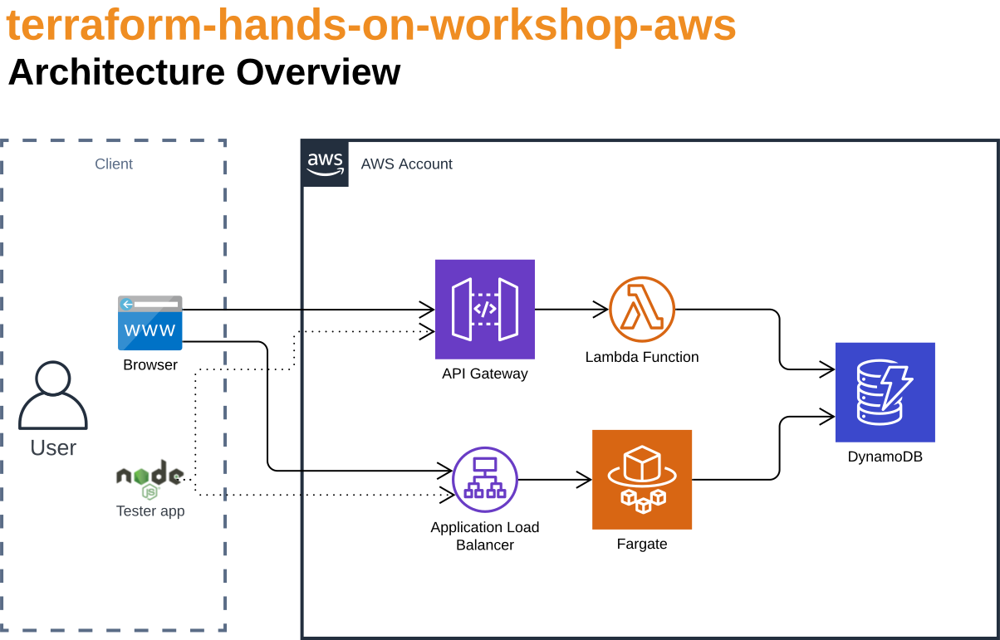
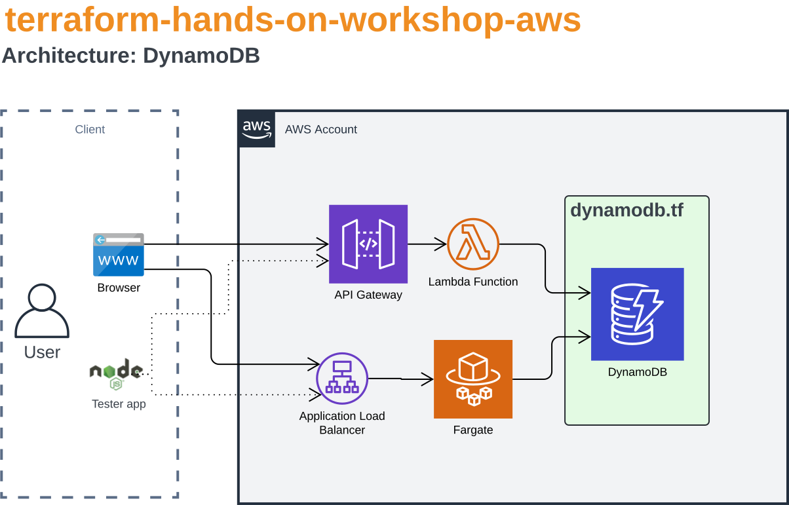
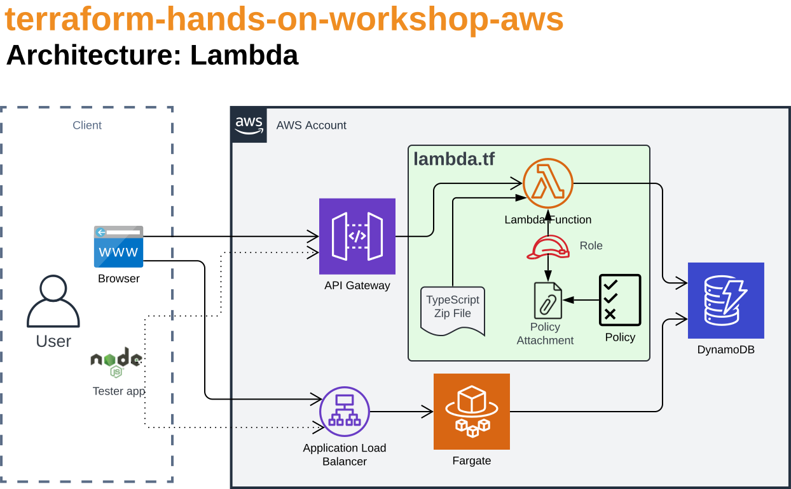
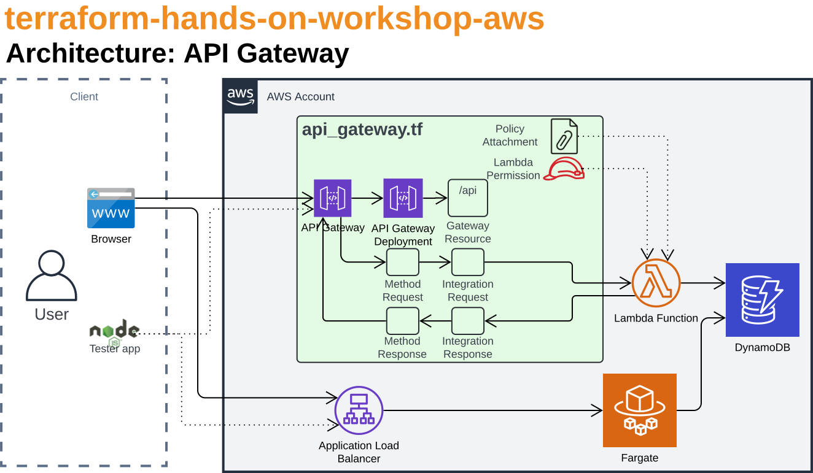
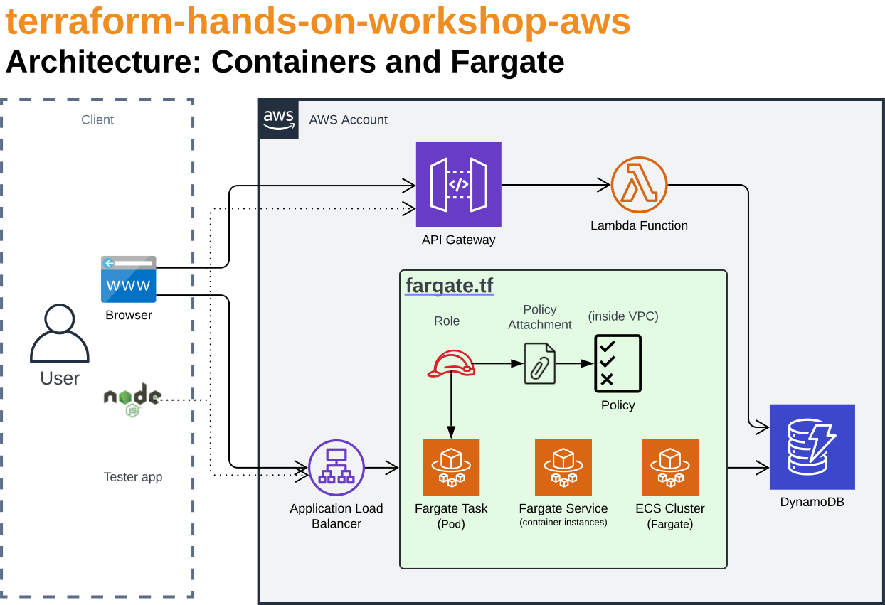

Running Terraform from a Terminal
=================================


Introduction
------------

Our goal in this section is to:

1. Code in [Terraform](https://developer.hashicorp.com/terraform/language)

2. Get familiar with the [AWS Terraform docs](https://registry.terraform.io/providers/hashicorp/aws/latest/docs)

3. Provision AWS resources with Terraform

> [!CAUTION]
> When you're done with this chapter, ensure you run `terraform destroy`.  (See the last step below.)  Running AWS resources longer than necessary is expensive.

> [!NOTE]
> Find anything missing or inaccurate?  Show me, and let's get it added to the courseware.


Setup
-----

If you haven't already, head to Chapter 0: Machine Setup and:

1. Ensure Terraform and AWS CLI are installed, updated, and you can run them in your terminal.

2. Ensure you're logged into AWS.

3. Clone this repository into a convenient folder on your machine.


Cleanup
-------

If you haven't already, head to Chapter 3: Click-Ops and:

1. Ensure you've deleted everything you created.  This chapter assumes it can create new ones.  If you create identically named things by clicking and then in Terraform, they'll collide.


What we'll build
----------------

We'll build a few AWS resources.  Not so much it's complex, but enough that it's real-world.



- DynamoDB database
- Lambda function connects to the database
- API Gateway in front of the Lambda
- Fargate (ECS) container connects to the database
- ALB (Application Load Balancer) in front of the container


Terraform Folder
----------------

Inside this start folder, create a `terraform` folder.

> `04-AWS-Terraform/start/terraform`

This is a convention we've chosen.  In your apps, you could choose other conventions.

In this chapter, we'll build everything inside the `terraform` folder.


Terraform Providers
-------------------

Terraform Providers allow you to build resources on a specific platform such as AWS, Azure, Kubernetes, CloudFoundry, and others.  See https://registry.terraform.io/browse/providers

In this workshop we'll use 2 providers:

- [Random](https://registry.terraform.io/providers/hashicorp/random/latest): Create random strings. We use this to avoid colliding with others in this workshop. In real projects, determinism (the same every time) is really important, so we'd likely not use this module in real-world projects.

- [AWS](https://registry.terraform.io/providers/hashicorp/aws/latest): Provision resources on AWS.


Random Provider
---------------

The Random provider allows us to create a random string.  In real projects, determinism is really important.  We use the Random provider here to guide our Terraform learning and to avoid colliding with other resources in the same account.  In production, we usually would **not** use the Random provider.

1. Inside `terraform` create `providers.tf` and open it in your favorite text editor.

2. In `providers.tf` add a reference to the Random provider:

   ```terraform
   terraform {
     required_providers {
       random = {
         source  = "hashicorp/random"
         version = "~>3.7"
       }
     }
   }
   ```

   Reference the Random provider's docs page at https://registry.terraform.io/providers/hashicorp/random/latest  You may find a later version and update this provider definition.

   We could have named this file anything, but by convention, providers are usually in `providers.tf` or `main.tf`.

3. Save the `providers.tf` file.

4. Because we added a provider or module reference, we need to initialize Terraform.

   **Warning:** Terraform commands apply only to the current folder.  It's important to ensure the terminal is running in the folder with your `.tf` files to ensure the commands work as expected.

   Open a shell inside the `terraform` folder and run this:

   ```sh
   terraform init
   ```

   This step created a lot of content in the start folder including:

   - .terraform folder
   - .terraform.lock.hcl

   These files are Terraform innards and should be added to a `.gitignore` file.

5. In the `start` folder, create a `.gitignore` file and add this text:

   ```
   .terraform*
   ```

   You can reference the `.gitignore` at the root of this repository for clues.

6. With the Provider added and initialized, let's use it.

   Inside `terraform` create `random.tf` and add this text:

   ```terraform
   # Only include lower-case alpha-numeric characters so we don't get naming errors in AWS or tfstate
   resource "random_string" "workshop_randomness" {
     length  = 8
     special = false
     upper   = false
   }
   ```

   See the random_string docs at https://registry.terraform.io/providers/hashicorp/random/latest/docs/resources/string

   In this code block, we use the `random_string` function of the `random` provider, and create a resource named `workshop_randomness`.  We could have named it anything.

   Note: Notice how we use `#` to create a comment in Terraform.  Terraform supports 2 types of one-line comments: `#` and `//`, and supports multi-line comments with `/*` and `*/` pairs.

   We could have named this file anything or included this resource definition in any existing file.

   We didn't need to add a reference to `providers.tf`.  Terraform automatically pulls in all files in the current directory.

   We could have put all the Terraform code in a single file, but this would make it difficult to reason about.  It's more effective to split different resources (or resource groups) into separate files.

7. Inside `terraform` create `output.tf` and add this text:

   ```terraform
   output "randomness" {
     value = random_string.workshop_randomness.id
   }
   ```

   See the Terraform `output` command docs at https://developer.hashicorp.com/terraform/language/values/outputs

   This will show the random string generated by the Random provider when we run Terraform.

8. Notice how we don't need to call functions or import files, we merely express our desired state.  Terraform uses all the `.tf` files and builds our solution.

9. In the shell inside the `terraform` folder, run this:

   ```sh
   terraform apply
   ```

   Then in the prompt answer `yes`.

10. Note in the console output the random string that was created.

11. In the terminal run this:

    ```sh
    terraform apply --auto-approve
    ```

    `--auto-approve` automatically answers `yes` to the prompt.

12. Note that the random string didn't change.  Terraform persisted the previous value and reused it.

13. `terraform apply` did create some new files we need to not check into source control.

    Open `.gitignore` and add this line:

    ```
    *.tfstate*
    ```

14. This `terraform.tfstate` file is interesting.  This is where Terraform stores the current state of the infrastructure it has provisioned.

    Open `terraform.tfstate` in your favorite editor and look around.

    **Warning:** It's definitely squirly in here.  You **NEVER** want to edit this file manually.  In most cases, we'll tuck this file into an S3 bucket or Azure Blob Storage and let the DevOps pipeline manage it exclusively.

15. Though the default is for Terraform to store `terraform.tfstate` locally, let's explicitly define it that way.

    Note: When we get to Chapter 6: DevOps, we'll move the `terraform.tfstate` file off our local machine and into S3.  Best practice is to never run production Terraform from a developer machine but always through a DevOps pipeline, keeping the state file in a shared, protected location.

    Open `providers.tf` and add the `backend` section:

    ```terraform
    terraform {
      required_providers {
        random = {
          source  = "hashicorp/random"
          version = "~>3.7"
        }
      }

      backend "local" {
      }
    }
    ```

    See the backend docs at https://developer.hashicorp.com/terraform/language/backend/local

16. Because we've modified a provider or module, we'll need to re-run initialization.

    In the shell, run this:

    ```sh
    terraform init
    ```

17. In the shell, run this:

    ```sh
    terraform apply --auto-approve
    ```

    Note that the random provider was already provisioned, so again nothing changed.

18. Let's take down our infrastructure.  Maybe we're practicing disaster recovery or maybe we're retiring the environment.

    In the shell, run this:

    ```sh
    terraform destroy --auto-approve
    ```

    Note how the console output shows what data it'll remove:

    ```
    Changes to Outputs:
      - randomness = "abc123de" -> null
    ```

    If we open `terraform.tfstate` it's nearly empty now.

19. Let's re-provision our resources.

    In the shell, run the `terraform apply` command.

    Note in the console output that we get a different random string.  This is good.  We're effectively in a new environment.

It was great to get our feet wet with Terraform using the Random provider.  Now let's provision some AWS resources.


AWS Provider
------------

Now that we got our feet wet with Terraform, let's build some AWS resources.

> [!CAUTION]
> From now on, we should treat the AWS Console (the AWS website) as **read-only**.  Yes, our account still has permission to create, edit, and remove resources.  But we should let Terraform do this for us.  From now on, **DO NOT** add, edit, or delete resources in the AWS website or the aws cli.

1. Open `providers.tf` and replace the contents with this text:

   ```terraform
   terraform {
     required_providers {
       random = {
         source  = "hashicorp/random"
         version = "~>3.7"
       }

       aws = {
         source  = "hashicorp/aws"
         version = "~> 5.88"
       }
     }

     backend "local" {
     }
   }

   provider "aws" {
     region = "us-east-1"
   }
   ```

   Check out the AWS provider docs at https://registry.terraform.io/providers/hashicorp/aws/latest/docs  Maybe you'll find a more recent version of the AWS provider?

   There's a lot going on here.

   - We specified the `aws` provider and version.
   - We specified the AWS region.  In this case we chose `us-east-1`.  In real-world scenarios we may want to set this from a variable.

   **Note:** It's important that all resources can run with the same provider version.  Terraform will automatically choose the highest provider version that both meets the version range set here and matches the versions needed by all resources and modules.  If there is no version that supports all resources and modules, the Terraform commands will fail.

   Terraform version ranges are great for automatically getting security updates and patched versions.  `~>1.0.4` says you can get `1.0.5` and `1.0.10` but not `1.1.0`.  `~>1.1` says you can get `1.0.5` and `1.2` but not `2.0`.  See also [Terraform version docs](https://developer.hashicorp.com/terraform/language/expressions/version-constraints)

2. We added a module or provider, so we again need to initialize Terraform.

   Open a shell inside the `terraform` folder and run this:

   ```sh
   terraform init
   ```

3. Now let's start slowly by validating we can connect to AWS.

   In `terraform` create a new file named `account.tf` and add this code to it:

   ```
   data "aws_caller_identity" "current" {
   }

   data "aws_region" "current" {
   }
   ```

   A `data` block queries our environment instead of setting things.  Therefore we don't need any parameters.  These statements say "get my current account" and "get my current region".

   See https://registry.terraform.io/providers/hashicorp/aws/latest/docs/data-sources/caller_identity and https://registry.terraform.io/providers/hashicorp/aws/latest/docs/data-sources/region

4. Let's output the details here and make sure we can connect to AWS.

   Open `output.tf` and add this:

   ```terraform
   output "aws_account_id" {
     value = data.aws_caller_identity.current.account_id
   }

   output "aws_region" {
     value = data.aws_region.current.name
   }
   ```

5. In the terminal, run the terraform apply command noting that you'd like to auto-approve the changes.  (See previous steps for clues.)

   If you got values for the current identity and region, congratulations! You're connected to AWS!

   If you didn't, you need to authenticate to AWS.

   If you use SSO, try re-running the login command:

   ```sh
   aws sso login --profile training
   ```

   Or try re-exporting the profile environment variable:

   Linux and macOS:

   ```sh
   export AWS_PROFILE="training"
   ```

   Windows PowerShell:

   ```powershell
   $env:AWS_PROFILE = "training"
   ```

   If that didn't work, try re-running the setup steps in chapter 0.


DynamoDB
--------

Now that we're connected to AWS, let's provision a DynamoDB.



1. Let's create a collection of local variables.

   In `terraform` create a file named `locals.tf` add this code to it:

   ```terraform
   locals {
     randomness          = random_string.workshop_randomness.id
     dynamodb_table_name = "dynamodb-${var.ENV_NAME}-${local.randomness}"
   }
   ```

   We stuck the randomness into a local variable.  Now instead of having to reference the full resource type and variable name, we can use this shortcut.

   We could have named this file anything or included the locals definition in any existing file.  By convention `locals.tf` is a good place to stick all these internal variables.

   We created another local variable: `dynamodb_table_name`.  When we provision the DynamoDB, we'll use this name for the table.

   In here we referenced the `ENV_NAME`.  Perhaps this is dev, staging, prod, etc.  In this workshop, we'll use your name.

   The dynamodb_table_name references a variable we'll pass in on each run.

2. Let's create the variables we'll pass in.

   In `terraform` create a file named `vars.tf` and add this code to it:

   ```terraform
   variable "ENV_NAME" {
     type = string
     description = "The environment name: dev, qa, prod, etc"
   }
   ```

   See the docs at https://developer.hashicorp.com/terraform/language/values/variables for more.

   We could have named this file anything or included the variable definition in any existing file.  By convention `vars.tf` is a good place to stick all user-entered variables.

3. Let's temporarily create an `output` to show the constructed `dynamodb_table_name`.

   Open `output.tf` and add this content at the end:

   ```terraform
   output "dynamodb_table_name" {
     value = local.dynamodb_table_name
   }
   ```

   This is a handy debugging tip.  If you're building crazy things, output details in breadcrumbs so you can watch the results.

4. In the terminal, run the terraform apply command noting that you'd like to auto-approve the changes.

   Note how it now prompts you for an environment name.  Type your name in all **lower-case** in the prompt.

   Notice the value of `dynamodb_table_name` in the results:

   ```
   Outputs:

   dynamodb_table_name = "dynamodb-rob-abc123ef"
   randomness = "abc123ef"
   ```

   It looks like we're forming the table name correctly.

5. Getting prompted for every variable each time is annoying though.  Let's create a local variables file.

   In `terraform` create a file named `input.tfvars` and add this text:

   ```
   ENV_NAME = "yournamehere"
   ```

   Replace `yournamehere` with your name, all lower-case.

   **WARNING:** It's important that the environment name only includes lower-case letters, numbers, and `-`.  ALBs don't support any other characters.  So if you're using upper-case, emoji, underscore, you'll fail to deploy an ALB.

6. This file is just for local debugging.  We don't want to check this in.

   Open `.gitignore` and add this line:

   ```
   *.tfvars
   ```

7. Re-run the `terraform apply` command referencing the new `input.tfvars` file:

   In the terminal in `terraform` run this:

   ```
   terraform apply --auto-approve --var-file="input.tfvars"
   ```

   **WARNING: Make sure your terminal is in the same directory as all the `.tf` files.  Most Terraform commands only apply to the current folder.

   No idea why the terminal requires quotes around the filename.

   Nice!  No more prompts for confirmation.  We'll run Terraform apply a lot in this course, and this is the command we'll continuously run.

8. Now let's create the DynamoDB table.

   In `terraform` create `dynamodb.tf` and add this text:

   ```terraform
   resource "aws_dynamodb_table" "dynamodb_table" {

     name = local.dynamodb_table_name

     hash_key  = "pk" # partition_key
     range_key = "sk" # sort_key

     attribute {
       name = "pk"
       type = "S"
     }

     attribute {
       name = "sk"
       type = "S"
     }

     billing_mode                = "PAY_PER_REQUEST"
     deletion_protection_enabled = false

     tags = var.tags
   }
   ```

   Here's all the parameters we entered when we created DynamoDB by clicking buttons in Chapter 3: Click-Ops.

   See the docs for the DynamoDB Terraform resource at https://registry.terraform.io/providers/hashicorp/aws/latest/docs/resources/dynamodb_table

   **Note:** In production scenarios, setting `delete_protection` to true is usually a very good thing; it blocks us from accidentally deleting production data.  In this tutorial where we're creating and deleting things so frequently, it is unhelpful.

9. Let's output the dynamodb arn AWS will assign us.

   Open `output.tf` and remove the `dynamodb_table_name` section.

   Add this text:

   ```terraform
   output "dynamodb_arn" {
     value = aws_dynamodb_table.dynamodb_table.arn
   }
   ```

10. We've referenced another user-provided variable: `tags`.

    Open `vars.tf` and add this text:

    ```terraform
    variable "tags" {
      type    = map(string)
      default = {}
    }
    ```

    So why is this one lower-case and the other upper-case?  The Platform Engineering team's DevOps template passes in vars as environment variables and upper-cases them all ... except this magic one for some reason.

    See `done/terraform` for the comment we often put at the top of the file noting this anomaly.

11. Add the `tags` to `input.tfvars`

    Open `input.tfvars` and add this text:

    ```terraform
    tags = {
      "project" = "terraform-workshop",
      "env"     = "YOUR_NAME_HERE" # <-- Change this
    }
    ```

   Tags are a great way to add ownership information, project details, software version information, or anything else that's interesting.  In the AWS console, you can search for resources by tag in the Resource Explorer.

12. In the terminal, set an environment variable for your chosen AWS profile.

    In Windows:

    ```powershell
    $env:AWS_PROFILE = "training"
    ```

    In Mac and Linux:

    ```sh
    export AWS_PROFILE="training"
    ```

    Change `training` to the AWS profile you configured in Chapter 0: Machine Setup.

13. We've changed a lot.  Save all files in your text editor -- just in case.

14. Run Terraform apply, noting that you'd like to auto-approve, and reference the tfvars file.

    Did you get an error?  Double check:

    - Did you run `terraform init` after adjusting `providers.tf`?
    - Did you authenticate to AWS with `aws sso login --profile my-aws-profile`?
    - Is there a syntax error in a .tf file?

15. Let's verify DynamoDB got created as expected.

    **Warning:** Consider the AWS console read-only now.  Terraform should create, edit, and delete these resources.  Modifying things in the AWS website will definitely do bad things.  At best, Terraform will undo your changes on next build.  At worst, the next build will cause Terraform to error, and you'll spend hours commenting out Terraform files, deleting resources, and pulling your hair out.  Save yourself a lot of grief: **don't modify stuff**.

    Open the AWS Console at https://us-east-1.console.aws.amazon.com/console/home?region=us-east-1 and in the search bar on the top-left, search for DynamoDB.  In the far left, choose tables.  Ta-da!  The table is created!

16. Though not required, let's run Terraform validate to check the Terraform syntax.

    In the terminal run this:

    ```sh
    terraform validate
    ```

    See https://developer.hashicorp.com/terraform/cli/commands/validate for more details.

17. Though not required, let's format the Terraform files.

    In the terminal run this:

    ```sh
    terraform fmt -recursive .
    ```

    See https://developer.hashicorp.com/terraform/cli/commands/fmt for more details.

    This doesn't check the Terraform syntax, but does nicely format all the files in the current directory and nested directories to be indented consistently.


AWS Lambda
----------

Now that we have a database, let's set the Lambda in place that uses it.

With the Lambda setup, there's a few more pieces we'll need to put in place.  Here's an architecture diagram with an exploded view of the Lambda pieces:



1. In `terraform` create a file named `lambda.tf` and add this code:

   ```terraform
   resource "aws_lambda_function" "api_lambda" {

     function_name = local.lambda_name
     description   = "a terraform workshop lambda"

     handler  = local.lambda_handler
     filename = var.LAMBDA_ZIP_FILE

     runtime = "nodejs22.x"

     role = aws_iam_role.api_lambda_role.arn

     environment {
       variables = local.environment_variables
     }

     memory_size = 256
     timeout     = 29 // API Gateway times out at 30 seconds

     tags = var.tags
   }
   ```

   See https://registry.terraform.io/providers/hashicorp/aws/latest/docs/resources/lambda_function for the Terraform Lambda parameters.  Is there a newer version of the Terraform Lambda resource?  Or the Node.js Lambda runtime?  See https://docs.aws.amazon.com/lambda/latest/dg/lambda-runtimes.html#runtimes-supported for a list of supported runtimes.

   In this resource definition, we've referenced a few things we'll need to create next:

   - `aws_iam_role.api_lambda_role.arn`
   - `var.LAMBDA_ZIP_FILE`
   - `local.lambda_name`
   - `local.lambda_handler`
   - `local.environment_variables`
   - An output showing the Lambda ARN

   Without these additional terraform blocks, this lambda won't apply correctly.

2. Let's start with the **AWS IAM role** for Lambda.

   In `lambda.tf` add the role and policy:

   ```terraform
   # the role to run the lambda
   resource "aws_iam_role" "api_lambda_role" {
     name               = "${local.lambda_name}-role"
     assume_role_policy = jsonencode({
       "Version": "2012-10-17",
        "Statement": [
        {
          "Action": "sts:AssumeRole",
          "Principal": {
            "Service": "lambda.amazonaws.com"
          },
          "Effect": "Allow",
          "Sid": ""
        }
        ]
     })
   }
   ```

3. The Lambda needs to query DynamoDB, so we'll also need a **policy** that'll allow the Lambda to query DynamoDB.

   In `lambda.tf` add this text:

   ```terraform
   # policy allows reading and writing to dynamodb and logs
   # https://docs.aws.amazon.com/amazondynamodb/latest/developerguide/iam-policy-example-data-crud.html
   resource "aws_iam_policy" "api_lambda_policy" {
     name   = "${local.lambda_name}-policy"
     path   = "/"
     policy = jsonencode({
       "Version": "2012-10-17",
       "Statement": [
         {
           "Action": [
             "logs:CreateLogGroup",
             "logs:CreateLogStream",
             "logs:PutLogEvents"
           ],
           "Resource": "arn:aws:logs:*:*:*",
           "Effect": "Allow"
         },
         {
           "Sid": "DynamoDBTableAccess",
           "Effect": "Allow",
           "Action": [
             "dynamodb:BatchGetItem",
             "dynamodb:BatchWriteItem",
             "dynamodb:ConditionCheckItem",
             "dynamodb:PutItem",
             "dynamodb:DescribeTable",
             "dynamodb:DeleteItem",
             "dynamodb:GetItem",
             "dynamodb:Scan",
             "dynamodb:Query",
             "dynamodb:UpdateItem"
           ],
           "Resource": "${aws_dynamodb_table.dynamodb_table.arn}"
         }
       ]
     })
   }

   # connect role and policy
   resource "aws_iam_role_policy_attachment" "api_lambda_policy_attachment" {
     role       = aws_iam_role.api_lambda_role.name
     policy_arn = aws_iam_policy.api_lambda_policy.arn
   }
   ```

   Note in the `"Resource"` block we're referencing the DynamoDB ARN.  We don't need to first create it then hard-code it!  Terraform for the win!

   Yes, technically all the Lambda does is `dynamodb:Query` so maybe the logging and other DynamoDB permissions are unnecessary.  But we'll use the same policy snippet to run the Fargate container, so let's leave them in.

4. With the Role and Policy created, let's output ARNs for the new resources we created.

   Open `output.tf` and add this:

   ```terraform
   output "lambda_arn" {
     value = aws_lambda_function.api_lambda.arn
   }

   output "lambda_role_arn" {
     value = aws_iam_role.api_lambda_role.arn
   }

   output "lambda_invoke_arn" {
     value = aws_lambda_function.api_lambda.invoke_arn
   }
   ```

5. Next, let's add the new `LAMBDA_ZIP_FILE` into vars.tf and input.tfvars.

   Open `vars.tf` and create a variable named `LAMBDA_ZIP_FILE`, make it of type `string` and give it a description.

   Open `input.tfvars` and add this text:

   ```
   LAMBDA_ZIP_FILE = "../artifacts/terraform-lambda.zip"
   ```

   By convention, we'll build into the `artifacts` directory in the root of the repository ... in this case the `start` folder.  So we first jump up through the `terraform` and then `devops` directories to get to `artifacts`.

6. Let's add the local variables.

   Open `locals.tf` and add the following into the locals block:

   ```terraform
     lambda_name = "api-lambda-${var.ENV_NAME}-${local.randomness}"
     lambda_handler = "app.dynamoDbQueryHandler" // the name of the function in the lambda typescript project
     environment_variables = {
       "DYNAMODB_TABLE" : local.dynamodb_table_name,
       "ENV_NAME" : var.ENV_NAME
     }
   ```

   These environment variables will be set in the Lambda, and read by the Node.js function.

   In [02: Apps/lambda/src/routes/lambda-handler.ts](../../02-Apps//lambda/src/routes/lambda-handler.ts#L22) we see this line: `const dynamodbTable = process.env.DYNAMODB_TABLE;` that pulls the environment variable we'll set here.

7. Now let's move the Lambda zip file into place.

   a. Inside the `start` folder, create a folder named `artifacts`.  The build typically drops this zip file here.

   b. Inside Chapter 2, inside apps/lambda, run `build.sh` or `./build.ps1` if you haven't yet.

   c. Copy Chapter 2's `lambda/dist/terraform-lambda.zip` into Chapter 4's `start/artifacts` directory.

   Now the zip file exists so Terraform can deploy it to AWS.

8. With everything created, run Terraform fmt, Terraform validate, and Terraform apply with the standard arguments.

   Did it error?  Double-check the Terraform syntax.  Perhaps diff `lambda.tf` between the `start` and `done` folders to find typos.

9. Let's verify the Lambda got created as expected.

   **NOTE:** Terraform creates stuff now.  Consider the AWS console read-only now.  **Don't modify stuff.**

   Open the AWS Console at https://us-east-1.console.aws.amazon.com/console/home?region=us-east-1 and in the search bar on the top-left, search for Lambda.  In the far left, choose functions.  Ta-da!  The function is created!  Click into it to see it go.

The Lambda exists, but we don't have an API Gateway in front yet.  The Lambda may not be internet routable yet.


AWS API Gateway
---------------

Let's provision the API Gateway to route traffic from the internet into the Lambda.

When we were doing Click-Ops in Chapter 2, we had to do a lot of pieces to get the API Gateway in place.  In Terraform we'll build all those pieces too.  Here's an architecture diagram with an exploded view for the API Gateway pieces:



1. In `terraform` create `api_gateway.tf` and add this text:

   ```terraform
   resource "aws_api_gateway_rest_api" "my_gateway" {

     name        = local.api_gateway_name
     description = "API Gateway for the Terraform workshop"

     endpoint_configuration {
       types = ["REGIONAL"]
     }

     tags = var.tags
   }
   ```

   See the API Gateway docs at https://registry.terraform.io/providers/hashicorp/aws/latest/docs/resources/api_gateway_rest_api

   This isn't the end of the API Gateway setup, but this will get the biggest piece in place.

2. We referenced a new local variable, `api_gateway_name`, so let's define it.

   Open `locals.tf` and before the ending `}`, add a line defining `api_gateway_name`.  Match the convention we've used previously, ensuring you add your name and the randomness in the value.

3. We created a new resource, so let's output the ARN.

   Open `output.tf` and add this block:

   ```terraform
   output "my_gateway_arn" {
     value = aws_api_gateway_rest_api.my_gateway.arn
   }
   ```

4. As we saw in 3: Click-Ops, creating an API Gateway is involved.

   - We need to create the 4 pieces: a method, an integration, a method response, and an integration response.
   - We need to create the deployment and the root resource.
   - We need to create a policy and either reference a built-in role or create a new role.
   - We need to give the API Gateway permission to call the Lambda.

   Open `done/terraform/api_gateway.tf`, and copy the full contents into `start/terraform/api_gateway.tf`, replacing everything you've built so far.

   Yep, it's super messy.  AWS, why did you have to create so many knobs and switches?!?

   Note that the `aws_api_gateway_method` is a `GET` so inbound traffic from the internet to the API Gateway will be a `GET`, but the Lambda requires a `POST` so `aws_api_gateway_integration` is a `POST` from API Gateway to Lambda.

5. As a helper to know what URL we should hit, let's output the full URL to the Lambda through the API Gateway.

   Open `output.tf` and after all other content, add this:

   ```terraform
   output "my_gateway_url" {
     value = "${aws_api_gateway_deployment.my_gateway.invoke_url}/${aws_api_gateway_resource}${aws_api_gateway_resource.root.path_part}"
     # https://docs.aws.amazon.com/apigateway/latest/developerguide/how-to-call-api.html
   }
   ```

6. Now with the API Gateway in place, let's apply it.

   Run Terraform fmt, Terraform validate, and Terraform apply each with the standard arguments.

   Note the new outputs showing the created resources.

   **Note:**: If Terraform failed, look at the console output for clues.  Is there a typo in the Terraform code?  Did you save all the files?  Is the console in the right directory?  As a last resort, diff the `start` and `done` folders looking for clues.

   **Note**: There's a warning about a deprecated argument in aws_api_gateway_deployment.  You can safely ignore that for now.

7. Let's look in the AWS Console at the resources created.

   a. Open a browser to https://us-east-1.console.aws.amazon.com/ and authenticate using your chosen credentials or SSO method.

   b. In the top-right, ensure you're in `us-east-1`, Virginia.

   c. In the top-left, search for API Gateway, and navigate into API Gateway.

   d. Choose the API Gateway that matches the Terraform output details.

   e. Click into the `GET` method for the API.

   That's really sweet.  See the configuration all in place: The 4 stages, the link to the Lambda, beautiful!

7. Let's test the lambda through the API Gateway.

   In the output look for `my_gateway_url`.  Copy it and paste it into a browser.  Add `?id=1` to the end.

   It's working if you get back a `404` together with an API response like this:

   ```json
   {"valid": false}
   ```

   See 02-Apps/lambda/src/routes/lambda-handler.ts#L47-L53

   The purpose of this function is to query the DynamoDB database, and we don't have anything in it yet.  So a 404 response is a success for now.


Optional: The Lambda Tester app
-------------------------------

Optional: If you have Node.js installed or if you [download and install Node.js](https://nodejs.org/en/download/package-manager), you can run the Lambda tester app in Chapter 4's `testers` folder to flex the lambda.

1. Open the `testers` folder in this 03 AWS Terraform folder.

2. Duplicate the `.env.example` file and rename it to `.env`.

3. Open `.env` in your favorite text editor and set `my_gateway_url` to match the Terraform apply output from the previous section.

4. Open a terminal in the `04-AWS-Terraform/testers` folder and run this:

   ```sh
   npm install
   node lambda-tester.js
   ```

   Note it too will show a 404 with the same JSON output above.

Success!

Here's everything we just built:

- We're hitting the API Gateway on the correct URL
- API Gateway routes the request through the gateway method, the integration, the method response, the integration response
- On the way out of the API Gateway, it heads to our JavaScript lambda
- The Lambda correctly queries DynamoDB
- DynamoDB doesn't have any data, and returns null
- The Lambda returns a 404 and the "valid:false" body
- The API Gateway forwards it back to the browser and tester app

Woo hoo!  That's a lot of really cool Terraform work you just did.


Fargate & ECS
-------------

Now that we have an API Gateway and a Lambda behind it querying into a DynamoDB, let's do the other half of a diagram.  Let's build Fargate & ECS behind an Application Load Balancer (ALB).

Running a container in Fargate has a lot of pieces:

- The Task: the recipe for starting a container
- The Service: the instance(s) of the container
- The Cluster: where the containers run

Here's an architecture diagram with an exploded view for the Fargate and ECS pieces to run the container:



Let's build each one.

1. Inside the `terraform` folder create `fargate.tf` and add this content:

   ```teraform
   // the container definition
   resource "aws_ecs_task_definition" "fargate_task" {
     family = local.fargate_task_name
     container_definitions = jsonencode([
       {
         name      = local.fargate_task_name
         image     = var.CONTAINER_IMAGE
         docker_authentication_enabled = false
         essential = true
         portMappings = [
           {
             containerPort = local.fargate_container_port
             hostPort      = local.fargate_container_port
           }
         ]
         environment = local.environment_variables # <-- this isn't right yet
       }
     ])

     requires_compatibilities = ["FARGATE"]
     network_mode             = "awsvpc"

     task_role_arn = aws_iam_role.fargate_role.arn

     # must match a standard configuration:
     # https://docs.aws.amazon.com/AmazonECS/latest/developerguide/task-cpu-memory-error.html
     cpu    = 256
     memory = 512

     tags = var.tags
   }
   ```

   See https://registry.terraform.io/providers/hashicorp/aws/latest/docs/resources/ecs_task_definition for the full list of parameters

   In this resource definition we're referencing things we haven't created yet:
   - a task name local variable
   - a container port local variable
   - a container image variable passed in
   - a role

   Let's take on each one.

2. Modify `vars.tf` and `input.tfvars` to add the `CONTAINER_IMAGE` variable.  Set the value in `input.tfvars` to this:

   ```terraform
   CONTAINER_IMAGE = "robrich/terraform-workshop-aws:latest"
   ```

   **Note:** We're using a pre-built image in [Docker Hub](https://hub.docker.com/r/robrich/terraform-workshop-aws) here for simplicity.  You could definitely build the app in 02-Apps/container and push it to your registry of choice: Artifactory, Elastic Container Registry, etc.  For the sake of simplicity in this workshop, we've already built this image for you.  If you'd like to build the image, you can install and configure a Docker build engine such as Docker Desktop, Podman, Rancher Desktop, Minikube, etc. then build and push the image to that registry.  Finally you'll need to configure authentication details from your private registry into the AWS Container Engine.  See Chapter 2 for the full instructions.  Yep, it's a long road and has nothing to do with Terraform.  Using [`robrich/terraform-workshop-aws:latest`](https://hub.docker.com/r/robrich/terraform-workshop-aws) makes that path a bit shorter today.  In production, you will want to go down that long road.

   **Note:** In order to pull this public image from Docker Hub, we don't need to authenticate to Docker Hub.  If we were using a private registry such as Elastic Container Registry, we'd need to set `docker_authentication_enabled = false` in `fargate.tf`.

3. Modify `locals.tf` to define both `fargate_task_name` and define `fargate_container_port = 3000`.

   Why are these in locals.tf instead of parameters passed in through vars?  These won't change between environments, so we can note them in the app's opinions, the locals.tf configuration.

4. Modify `output.tf` to output the task ARN.  The output value you'll use is `aws_ecs_task_definition.fargate_task.arn`.

5. Create an [`aws_iam_role`](https://registry.terraform.io/providers/hashicorp/aws/latest/docs/resources/iam_role.html) in `fargate.tf` similar to the role we created for the lambda in `lambda.tf`.  Name this role `${local.fargate_task_name}-role` to match the parameter into the ECS Task.

   In the previous role the service assumed was ~~`lambda.amazonaws.com`~~.  In this role we'll assume the service `ecs-tasks.amazonaws.com`.

6. In `output.tf`, output `fargate_role`'s ARN.

7. Run Terraform fmt, Terraform validate, and Terraform apply commands in the `start/terraform` directory with the standard parameters.  Note the error:

   ```
   Error: ECS Task Definition container_definitions is invalid: json: cannot unmarshal object into Go struct field ContainerDefinition.Environment of type []types.KeyValuePair
   ```

   Looks like we have the wrong format.  For Lambda, it wants the environment variables to be `{"VAR_NAME": "var_value","VAR_NAME": "var_value"}` but the [task definiton docs](https://registry.terraform.io/providers/hashicorp/aws/latest/docs/resources/ecs_task_definition) note containers want the variables to be `[{"name":"VAR_NAME","value":"var_value"}, {"name":"VAR_NAME","value":"var_value"}]`.  Let's learn about Terraform `for` statements.

8. In `fargate.tf` temporarily comment out the line `environment = local.environment_variables` with a `#` or a `//`.  Now Terraform apply won't error while we figure out the `for` loop syntax.

9. Open `output.tf` and add this:

   ```terraform
   output "environment_variables_for_lambda" {
     value = local.environment_variables
   }

   output "environment_variables_for_fargate" {
     value = local.environment_variables
   }
   ```

10. Run Terraform apply now.  You'll see the two new outputs are identical.

11. Modify the `..._for_fargate` into a loop:

    ```terraform
    output "environment_variables_for_fargate" {
      value = [for key, value in local.environment_variables : "${key} = ${value}" ]
    }
    ```

    This feels a bit like Python's loops.  The syntax is `[for var in array : result]`

    We've created an interpolated string here that shows (almost) the object definition we had before ... now in an array.

12. Let's modify the loop to show an object:

    ```terraform
    output "environment_variables_for_fargate" {
      value = [for key, value in local.environment_variables : { "name" = "${key} = ${value}" }]
    }
    ```

    We're getting closer.

13. Now we need this object to have two separate properties:

    ```terraform
    output "environment_variables_for_fargate" {
      value = [for key, value in local.environment_variables : { "name" = key, "value" = value }]
    }
    ```

    Success!  It now matches the definition we need for Fargate environment variables!

    **Pro tip:** a great way to get immediate feedback, quickly iterate, and discover the solution.  Once the solution is found, set it into place in the correct spot and kick off the build.

14. Now that we found the correct sequence, let's add more environment variables for node.

    Open `locals.tf` and modify the `environment_variables` section to this:

    ```terraform
      environment_variables = {
        "DYNAMODB_TABLE" : local.dynamodb_table_name,
        "ENV_NAME" : var.ENV_NAME
        "NODE_ENV" : "production"
        "NODE_PORT" : tostring(local.fargate_container_port)
      }
    ```

    We have to use [tostring()](https://developer.hashicorp.com/terraform/language/functions/tostring) because `fargate_container_port` is a number and we need a `map(string:string)` for the environment variables.

15. Let's set the environment variables into the Fargate container.

    a. Open `fargate.tf`.

    b. Uncomment the line `environment = local.environment_variables` by removing the leading `#` or `//`.

    c. Replace ~~`local.environment_variables`~~ with the correct expression we discovered in `output.tf`.

16. Run Terraform fmt, Terraform validate, and apply with the standard parameters.  The error is gone.

17. We need to give the container permission to access DynamoDB.

    Like we did for Lambda, create a new `aws_iam_policy` and `aws_iam_role_policy_attachment` and attach it to `fargate_role`.  Name these to reference `local.fargate_task_name`.

    **Note:** The permissions needed in this policy are identical to the Lambda policy: access to DynamoDB.  You can copy the policy from `lambda.tf` and adjust the names.

18. Next we need an ECS cluster to run the container.

    In `fargate.tf`, add a resource of type [`aws_ecs_cluster`](https://registry.terraform.io/providers/hashicorp/aws/latest/docs/resources/ecs_cluster) named `ecs_cluster` with a name and tags.

19. We created a new resource that references a parameter we haven't defined.  Adjust `locals.tf` to define `fargate_cluster_name`.

20. It's always a good idea to output the ARNs of the resources created.  Modify `output.tf` to show the ARN of `ecs_cluster`.

21. Run Terraform fmt, Terraform validate, and Terraform apply with the standard parameters.

Woo hoo!  We've got the ECS Cluster started, the Fargate task, and now we need only the `ecs_service` that connects them.  The `ecs_service` depends on a lot of networking components and an Application Load Balancer (ALB), so let's create those first.

**Pro tip:** Notice how we're slowly building up the Terraform archive.  After each step, we run it and validate we've done that part correctly.  Only when it succeeds do we move on to the next part.


Networking
----------

We're about to dive into the belly of AWS networking.  And we have a choice to make depending on the account setup we're using.

To create an Application Load Balancer, we need a lot of AWS infrastructure:

- A VPC
- Public subnets
- Private subnets
- A public security group
- A private security group
- An internet gateway
- NAT Gateways
- Elastic IPs
- Route
- Route table

Wow, this is a mouth full.  For simplicity in this workshop, you won't need to figure out each of these.  Rather you'll use a pre-provisioned template.

And here's the choice we need to make.  Maybe your employer's Platform Engineering team has provisioned this for you?

**Use Option 1**: if you're in an account **without** a pre-provisioned VPC such as a personal or free trial account, or any other non-managed account.  We'll create the necessary resources through Terraform.

**Use Option 2** if you're using an account **with** a pre-provisioned VPC such as an account provisioned by your employer.  We'll assume these resources already exist and we'll query for the ones we need.

What's the difference?  Option 2 assumes these things already exist and queries for them.  Option 1 creates them.

1. Navigate to the `done/terraform` folder.

2. Find `network-opt1.tf` or `network-opt2.tf`.

3. Copy your chosen file to the `start/terraform` folder.

4. Open this file, let your eyes glaze over, and be thankful it's already done.  😊

If you chose `network-opt1.tf`, define a local `availability_zone_count = 2`.


Application Load Balancer (ALB)
-------------------------------

With the networking setup, let's create the Application Load Balancer (ALB).  Normally we'd use one ALB for all the apps in the project or maybe for all apps in the account.  Since we only have a single app, we'll create an ALB for this one project.

Here's an architecture diagram with an exploded view for the ALB:


1. Create a new file in `terraform` named `alb.tf`.

2. Create the ALB with this snippet:

   ```terraform
   resource "aws_alb" "alb" {
     name            = local.alb_name
     subnets         = [for s in /*data.*/ aws_subnet.public : s.id]
     security_groups = [/*data.*/ aws_security_group.lb.id]

     tags = var.tags
   }
   ```

   See https://registry.terraform.io/providers/hashicorp/aws/latest/docs/resources/lb.html

   **Note:** If you're using Option 2, uncomment the `/*data.*/` sections.  So `[for s in /*data.*/ aws_subnet.public : s.id]` becomes `[for s in data.aws_subnet.public : s.id]`.

   If you're using Option 1, no need to uncomment these.

   The ALB needs access to the public IPs and public security group.

3. The ALB's name isn't defined yet.  Open `locals.tf` and make the necessary adjustments.

4. Output the ALB's ARN in `output.tf`.

5. Next we create the ALB target group.  This will point to the container.

   In `alb.tf` add this section:

   ```terraform
   resource "aws_alb_target_group" "alb_target" {
     name        = local.alb_name
     port        = local.fargate_container_port
     protocol    = "HTTP"
     vpc_id      = /*data.*/aws_vpc.main.id
     target_type = "ip"

     // a static url in the container:
     health_check {
       healthy_threshold   = "3"
       interval            = "30"
       protocol            = "HTTP"
       matcher             = "200"
       timeout             = "3"
       path                = "/"
       unhealthy_threshold = "2"
     }

     tags = var.tags
   }
   ```

   If you're using Option 2, uncomment all the `/*data.*/` blocks.

6. Also in `alb.tf` add the front_end listener:

   ```terraform
   # Reply to anything else
   resource "aws_alb_listener" "front_end" {
     load_balancer_arn = aws_alb.alb.id
     port              = local.alb_public_port
     protocol          = "HTTP"

     default_action {
       type = "fixed-response"
       fixed_response {
         content_type = "text/plain"
         message_body = "Hello from the ALB!"
         status_code  = "200"
       }
     }

     tags = var.tags
   }
   ```

   In this front_end listener, we're returning a static 200.  One might forward this straight to the container.  We've chosen instead to show a static page, and create a new listener for each container route.

7. Now let's route `/api/*` to the container.  Still in `alb.tf` add this section:

   ```terraform
   # Send /api/* to the target group
   resource "aws_lb_listener_rule" "path_routing" {
     listener_arn = aws_alb_listener.front_end.arn
     # from 1 to 50000, lower is first
     priority = 100

     action {
       target_group_arn = aws_alb_target_group.alb_target.id
       type             = "forward"
     }

     condition {
       path_pattern {
         values = ["/api/*"]
       }
     }

     depends_on = [aws_alb_target_group.alb_target]
   }
   ```

8. In `locals.tf`, let's define `alb_public_port` and set it to `80`.

   In production, we'll want this to be port 443.  But we don't have a TLS certificate yet.

9. One last piece: let's output a few details about the ALB:

   In `output.tf` add this section:

   ```terraform
   output "alb_dns_name" {
     value = aws_alb.alb.dns_name
   }

   output "alb_url" {
     value = "http://${aws_alb.alb.dns_name}/api/"
   }

   output "alb_gateway_public_ip" {
     value = [for g in /*data.*/aws_nat_gateway.gw : g.public_ip]
   }
   ```

   These aren't strictly necessary, but it'll help us test the infrastructure later.

   **Note:** If you're using Networking Option 2, ensure you uncomment the `/*data.*/` blocks.

   See https://registry.terraform.io/providers/hashicorp/aws/latest/docs/resources/lb.html for the list of output parameters from the ALB.

10. Run Terraform fmt, Terraform validate, and Terraform apply with the standard parameters to deploy the ALB.

    **Note:** Deploying an ALB takes a good while.  If this doesn't error starting, you can continue to the next section as it provisions in AWS.

The Application Load Balancer (ALB) is quite complex.  In the next chapter we'll look at abstracting this complexity into modules.

If you're struggling to get all the pieces in place, consider diffing your `start` folder with the `done` folder to see what might be amiss.  It's really easy to get a stray `{` or `:` and the whole thing to not work as expected.


ECS (Fargate) Service
---------------------

Now that the Application Load Balancer (ALB) is in place, let's get the final piece of the container setup in place: The Fargate (ECS) service.

An ECS Service is an instance of an ECS Task -- a running container.

1. Open `fargate.tf` and add this:

   ```terraform
   // the instance(s) of the container
   resource "aws_ecs_service" "fargate_service" {
     name            = local.fargate_service_name
     cluster         = aws_ecs_cluster.ecs_cluster.id
     task_definition = aws_ecs_task_definition.fargate_task.arn
     desired_count   = local.fargate_container_count
     launch_type     = "FARGATE"

     network_configuration {
       security_groups  = [/*data.*/aws_security_group.ecs_tasks.id]
       subnets          = [for s in /*data.*/aws_subnet.private : s.id]
       assign_public_ip = true
     }

     load_balancer {
       target_group_arn = aws_alb_target_group.alb_target.id
       container_name   = local.fargate_task_name
       container_port   = local.fargate_container_port
     }

     depends_on = [
       aws_alb_listener.front_end,
       aws_iam_role_policy_attachment.fargate_role_policy_attachment
     ]

     tags = var.tags
   }
   ```

   **Note:** If you're using Networking Option 2, ensure you uncomment the `/*data.*/` blocks.

   See https://registry.terraform.io/providers/hashicorp/aws/latest/docs/resources/ecs_service for more details on the parameters for this resource.

   We needed to create the network components and ALB first because this service needs a reference to them.

   Though not strictly necessary, the `depends_on` list helps Terraform know those other resources must exist first before creating this, and when destroying, ensure this is destroyed before those.  In most cases, the AWS Terraform provider can infer this automatically.  So we're just being extra careful with this line.

2. As we have before, update `locals.tf` to define `fargate_service_name`.

3. In `locals.tf` also define `fargate_container_count` and set it to `1`.

   For high availability, we'll want 3 or more containers.  For today's workshop, only one container instance will be cheaper.

4. In `output.tf`, create an entry for `fargate_service_arn` that spits out the ARN of the resource we just created.

   See https://registry.terraform.io/providers/hashicorp/aws/latest/docs/resources/ecs_service for the details of how the `arn` is returned from this resource.

5. Run Terraform fmt, Terraform validate, and Terraform apply with the standard parameters to deploy the final solution.

   Note that if the ALB deploy isn't quite done yet, you'll first need to wait for that to finish.


Testing the Container
---------------------

Now that we have the Fargate container running and the ALB in front, let's take the app for a spin.

1. Look to the Terraform output for `alb_url`.  This is not just the URL to the ALB, but now that the ALB forwards to a running container, it's the URL through the ALB into the container.

2. Plug this URL into the browser, adding `/1` to the end.  If it's all working, you'll correctly get a 404 and this JSON output: `{"valid":false}`, noting that ID 1 doesn't exist.

3. Optional: If you have Node.js installed, you can run the Node.js tester app.

   a. Open the `04-AWS-Terraform/testers` folder.

   b. If you didn't previously, copy `.env.example` to `.env`.

   c. Open `.env` in your text editor.

   d. Update the `alb_url` value to the output at the end of the Terraform apply command.

   e. Open `fargate-tester.js` in your editor.

   f. At the top of the file, modify `dynamo_pk` and `some_obj` to whatever details you'd like.

   g. Open a terminal in the `04-AWS-Terraform/testers` folder and run this:

      ```sh
      npm install
      node fargate-tester.js
      ```

   h. It first goes to the ALB's static page that returns `Hello from the ALB!`, then inserts a new record into DynamoDB, then gets the record.

      Verify your output is successful.

   i. Open the AWS console website, search for DynamoDB in the top-left, click on tables, choose your table, and in the top-right, click explore items.

   j. See the item you created?  Success!

4. Optional: If you have Node.js installed, you can now successfully run the Lambda too.

   a. Open `lambda-tester.js` in a text editor, and modify `dynamo_pk` to match the choice you made in `fargate-tester.js`.

   b. In the terminal run this:

      ```sh
      node lambda-tester.js
      ```

   c. Now instead of a 404, you'll get the same DynamoDB object returned.

If we successfully ran the ALB test it means:

- We connected to the ALB
- The ALB route forwarded the request to the ECS service
- The ECS service is an instance of the Fargate task which includes the container
- The ECS cluster runs in a VPC we either created or discovered together with internet gateways and IPs
- The container adds data to DynamoDB
- DynamoDB notes the data is saved successfully
- The container returns the success result to the ECS service
- ECS returns the result to ALB
- ALB returns the result to the browser and tester app

Woo hoo!  That's quite an impressive stack of Terraform you just built.


**IMPORTANT**: Destroy the infrastructure
-----------------------------------------

> [!CAUTION]
> It is **very** important to delete all the resources created today.  AWS continues to charge your account as long as these resources are running.  Ensure you've deleted all resources at the end of this chapter to save yourself money.  The next chapter also assumes you're starting without these resources provisioned.  Let's delete all the resources.

1. Open a terminal in `04-AWS-Terraform/start/terraform` and run:

   ```sh
   terraform destroy --auto-approve --var-file="input.tfvars"
   ```

Yes, it'll likely take a good while to delete the ALB.  While it's deleting, you can proceed to Chapter 4.


Summary
-------

In this module we learned a lot about how to provision resources in AWS using Terraform.

We provisioned:

- DynamoDB
- A Lambda function
- An API Gateway that routes to the Lambda
- A container in Fargate (ECS)
- An ALB that routes to the container
- All the networking needed to create a VPC for ECS

That's a lot!

We also learned:

- Terraform syntax
- Terraform console commands including `init`, `apply`, and `destroy`
- Collecting helpful ARNs and URLs using output statements
- Building reusable local variables
- Accepting platform-specific variables on the command line
- Terraform loop syntax
- Debugging Terraform resources with output statements

Wow!  We're getting really good at Terraform.  Give yourself a good pat on the back.  You did a lot!
