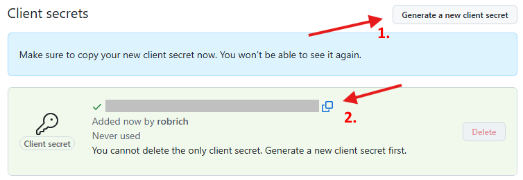
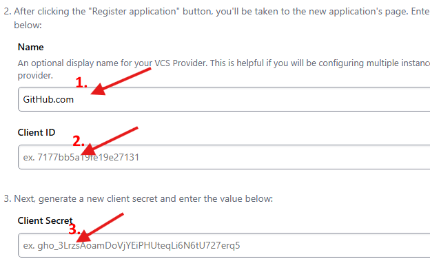
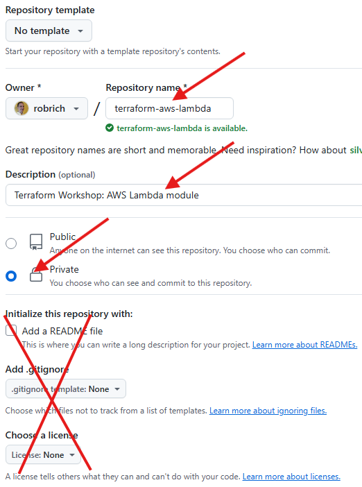
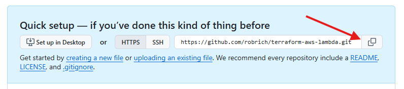
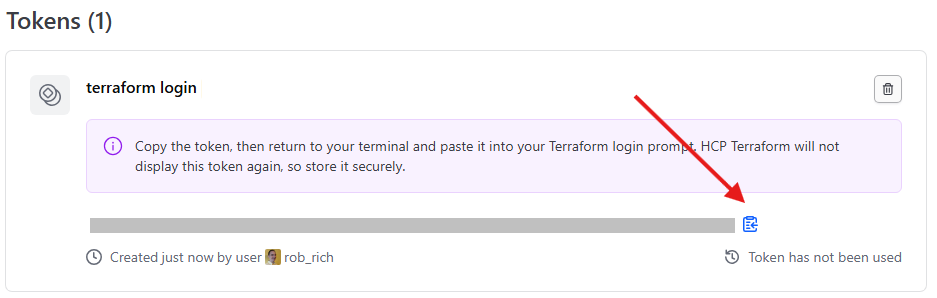

Terraform Modules
=================


Introduction
------------

Our goal in this section is to:

1. Learn about [Terraform Modules](https://developer.hashicorp.com/terraform/language/modules)

2. Learn about private Terraform Registries

3. Begin thinking through creating standard modules to abstract common patterns and best practices

4. Provision the same solution using custom modules

> [!CAUTION]
> When you're done with this chapter, ensure you run `terraform destroy`.  (See the last step below.)  Running AWS resources longer than necessary is expensive.


Setup
-----

If you haven't already, head to Chapter 0: Machine Setup and:

1. Ensure Terraform and AWS CLI are installed, updated, and in your `PATH`.

2. Ensure you're logged into AWS from the command line.

3. Clone this repository into a convenient folder on your machine.


Cleanup
-------

If you haven't already, head to Chapter 4: AWS Terraform and:

1. Ensure you've deleted everything you created.  This chapter assumes it can create new ones.  If you create identically named things with a different Terraform state file and you will now create more, they may collide.


What we'll build
----------------

We'll start this chapter where the previous chapter leaves off.  In this chapter we'll look at modules and how we can abstract the complexity of AWS resources behind opinionated groups of functionality.

Here's the architecture diagram of what we'll build:


- DynamoDB database
- Lambda function connects to the database
- API Gateway in front of the Lambda


Terraform Folder
----------------

We'll start this chapter where the previous chapter leaves off.

1. Inside this start folder, create a `terraform` folder.

   > `05-Modules/start/terraform`

   This is a convention we've chosen.  In your apps, you could choose other conventions.

2. Copy everything from the previous chapter into place.

   Copy all files from `04-AWS-Terraform/start/terraform` into `05-Modules/start/terraform`.

   Copy all files from `04-AWS-Terraform/start/artifacts` into `54-Modules/start/artifacts`.

3. Remove all the Terraform state files:

   In the 05: Modules/start/terraform folder, delete:

   - `.terraform` folder
   - `.terraform.lock.hcl`
   - `terraform.tfstate`
   - `terraform.tfstate.backup`

4. Optional: Let's focus on the API Gateway -> Lambda -> DynamoDB process.

   Inside `05-Modules/start`, delete these files:

   - fargate.tf
   - alb.tf
   - network-opt*.tf

   Remove references to Fargate and ALB from `output.tf` and `vars.tf`.

5. Run Terraform init, Terraform fmt, and terraform validate to ensure we've got the folder free from typos.

In this chapter, we'll build everything inside the `terraform` folder.


A Local Module for Lambda
-------------------------

In Chapter 4, we created a lot of resources.  Some of them were really complex.  We definitely need to create all these resources.  But we could create a bucket - a module - an opinionated function - that builds all these details for us, given a few parameters.  We could build an opinionated module that takes in the few things that change, and generates all the resources, follows all the best practices, and returns the created resource details.

Let's create a local module that builds a Node.js Lambda function together with the role and policy to connect to DynamoDB.

1. Inside `05-Modules/start/terraform` create a new folder named `lambda`.

2. Move `lambda.tf` into this folder.

3. Open `lambda.tf` in a text editor.

   Let's consider what parameters we might want in our opinionated Lambda generator.

   Let's assume we want to always build a Node.js lambda that has access to DynamoDB.

   Perhaps we'd pass in:

   - function_name
   - description
   - handler
   - zip_filename
   - environment_variables
   - tags
   - dynamodb_arn

   And then the module could:

   - provision the Lambda
   - build the role
   - set the policy to access DynamoDB

   And finally it could return:

   - lambda_arn
   - role_arn
   - lambda_invoke_arn

4. Inside the `lambda` folder, create `vars.tf` and add this:

   **Caution:** These are the variables for our new Lambda module.  These aren't the variables for the entire Terraform project.  Don't modify the existing `vars.tf` but rather create a new one inside the folder.

   ```terraform
   variable "function_name" {
     type        = string
     description = "The name of the Lambda resource"
   }

   variable "description" {
     type        = string
     description = "A friendly description to add to the Lambda resource"
   }

   variable "handler" {
     type        = string
     description = "The Node function in the zip file to call when running the lambda"
   }

   variable "zip_filename" {
     type        = string
     description = "The path to the zip file that includes the source code"
   }

   variable "environment_variables" {
     type        = map(string)
     description = "Environment variables needed by the Node.js function"
   }

   variable "tags" {
     type        = map(string)
     description = "hardware tags to add to the Lambda"
   }

   variable "dynamodb_arn" {
     type        = string
     description = "The ARN of the DynamoDB database we'll connect to"
   }
   ```

   Yeah, our module has a lot of parameters.  That's ok.  Later in this chapter, we'll refactor this module to separate concerns: Lambda, Role & Policy, etc.  Then we'll need less parameters in this module.

5. Now let's modify `lambda.tf` to use these module parameters.

   Inside the `lambda` folder, open `lambda.tf` and modify it to this:

   ```terraform
   resource "aws_lambda_function" "api_lambda" {

     function_name = var.function_name
     description   = var.description

     handler  = var.handler
     filename = var.zip_filename

     runtime = "nodejs22.x"

     role = aws_iam_role.api_lambda_role.arn

     environment {
       variables = var.environment_variables
     }

     memory_size = 256
     timeout     = 29 // API Gateway times out at 30 seconds

     tags = var.tags
   }
   ```

   **Note**: Often modules have a `main.tf` that has the bulkiest, meatiest part of the code.  In our case we called it `lambda.tf`.  If you'd like, you can rename this file to `main.tf` and it will continue working as expected.

6. inside the `lambda` folder inside `lambda.tf` adjust the other references from `local.` and `dynamodb_table.arn` to these variables in `var.tf`.  You'll need to replace these references:

   - ~~`local.lambda_name`~~ becomes `var.function_name`
   - ~~`aws_dynamodb_table.dynamodb_table.arn`~~ becomes `var.dynamodb_arn`

7. Inside the `lambda` folder, create a new `output.tf` file and add this:

   **Important:** These are the output results for our new Lambda module.  These aren't the output details for the entire Terraform project.  Don't modify the existing `output.tf` but rather create a new one inside the folder.

   ```terraform
   output "lambda_arn" {
    # TODO: set this
   }

   output "lambda_invoke_arn" {
    # TODO: set this
   }

   output "role_arn" {
    # TODO: set this
   }

   output "role_name" {
     # TODO: set this
   }

   output "function_name" {
     # TODO: set this
   }
   ```

   Use the knowledge you gained from chapter 4 to set the values needed here. Hint: these are output attributes from the resources created.

8. We now have this local module created.  Let's modify the original file to use it.

9. Outside the `lambda` folder, in `terraform`, create a new `lambda.tf` file and add this content to it:

   ```terraform
   module "api_lambda" {
     source = "./lambda"

     function_name = local.lambda_name
     description   = "a terraform workshop lambda"
     handler       = local.lambda_handler
     zip_filename  = var.LAMBDA_ZIP_FILE
     environment_variables = local.environment_variables
     tags = var.tags
     dynamodb_arn = aws_dynamodb_table.dynamodb_table.arn
   }
   ```

   Notice how we don't need the sprawling role, policy, and policy attachment.  We've abstracted that behind this new local module.

10. Outside the `lambda` folder, in `terraform`, open `output.tf` and modify these lines:

    ```terraform
    output "lambda_arn" {
      value = module.api_lambda.lambda_arn
    }

    output "lambda_role_arn" {
      value = module.api_lambda.role_arn
    }

    output "lambda_invoke_arn" {
      value = module.api_lambda.lambda_invoke_arn
    }
    ```

    Notice how this is much simpler too.

11. Open up `api_gateway.tf` and make similar modifications:

    - ~~`aws_lambda_function.api_lambda`~~ to `module.api_lambda`
    - ~~`aws_iam_role.api_lambda_role.name`~~ to `module.api_lambda.role_name`

12. If we had other references to the lambda, we could modify them to the new module as well.

13. If we had many lambdas, we could now call this new lambda module from many places in the outer folder.  Or we could create an array of lambda functions and use [`for_each`](https://developer.hashicorp.com/terraform/language/meta-arguments/for_each) to construct multiple lambdas from this same module.

14. Open a terminal inside `05-Modules/start/terraform`.

15. Because we added a new module, we need to re-run `terraform init`.  In the terminal in `05-Modules/start/terraform` run:

    ```sh
    terraform init
    ```

16. Run Terraform fmt and Terraform apply commands with their respective arguments.

    See Chapter 4 for more details here.

    It takes a while to create an ALB.  No need to wait.  You can continue through the workshop while the ALB finishes provisioning.

The console output looks very familiar.  It's still creating the same cloud resources on AWS.  We've now made a simpler mechanism for building it.

**Note**: We're deleting and creating identical objects with the same name.  AWS may get really grumpy about this, and Terraform apply may fail.  If so try this:

**WARNING**: Don't do this with a database.

1. Open `locals.tf` and modify the affected resource names.

2. Run Terraform apply.

3. In `locals.tf` put the names back.

4. Run Terraform apply again.

If that didn't work, try this:

1. Open the affected terraform file(s).

2. Comment out the resources by putting `/*` at the top of the file and `*/` at the bottom.

3. Also comment out dependent resources.

4. Comment out references in `output.tf` as well.

5. Run Terraform apply to delete them all.

6. Uncomment everything.

7. Run Terraform apply to recreate them again.


More Generic Modules
--------------------

Our current Lambda module is incredibly opinionated and therefore not very versatile.  It assumes we're using Node.js and that we're connecting to DynamoDB.  What if we also want to connect to S3 or want to run a .NET or Java function instead?  Let's split this Lambda module in half: one for the policy and one for the Lambda and role.

**Note**: There's nuance and subtlety here.  Does it make sense to split apart?  Does it make sense to hard-code certain opinions or make them overridable?  Or does it make more sense to use the AWS resources directly?  For example, should the Lambda module take in a role instead of a policy?  There's an art to this, and your situation may dictate a different solution than mine.


Lambda Module
-------------

1. Inside `05-Modules/start/terraform` create a new folder named `dynamodb_policy`.

2. Copy all the files from the `Modules/start/terraform/lambda` folder into the new `dynamodb_policy` folder.

3. Inside the `dynamodb_policy` folder, rename `lambda.tf` to `policy.tf`.

4. Inside `policy.tf`, delete the Lambda, Role, and Attachment definitions leaving only the policy definition.

5. Inside `policy.tf`, change ~~`name = "${var.function_name}-policy"` to `name = "${var.policy_name}"`.

6. In the `dynamodb_policy` folder, in `vars.tf`, replace the contents of the file with this:

   ```terraform
      variable "policy_name" {
     type        = string
     description = "The name of the Policy resource"
   }

   variable "dynamodb_arn" {
     type        = string
     description = "The ARN of the DynamoDB database we'll connect to"
   }
   ```

7. In the `dynamodb_policy` folder, in `output.tf`, replace the contents of the file with this:

   ```terraform
      output "policy_arn" {
     value = aws_iam_policy.api_lambda_policy.arn
   }
   ```

8. In the `start/terraform` folder (outside any modules), modify `lambda.tf` adding this module definition at the bottom:

   ```terraform
   module "dynamodb_policy" {
     source = "./dynamodb-policy"

     policy_name = "${local.lambda_name}-policy"
     dynamodb_arn = aws_dynamodb_table.dynamodb_table.arn
   }
   ```

9. In the `start/terraform` folder (outside any modules), modify `output.tf` to log the policy module's ARN.

10. We've built and consumed a module that centralizes our DynamoDB permissions.  Now let's modify the Lambda module to take in this policy's ARN.

11. Inside the `start/terraform/lambda` folder, change `vars.tf`:  Change the ~~`dynamodb_arn`~~ reference to `policy_arn` and adjust the description to match.

12. Also inside the `lambda` folder open `lambda.tf` and modify:

    - remove the ~~`aws_iam_policy`~~ definition.
    - update the policy attachment to use `var.policy_arn`.

13. Outside the `lambda` folder in `start/terraform`, open `lambda.tf` and adjust the parameters to the lambda module.


Generalized Lambda and Policy Modules
-------------------------------------

The Lambda module is still quite opinionated.  It assumes a Node.js lambda with 256 megs ram.  Let's make these optional parameters, allowing consumers of this module to pass in other runtimes or memory limits.

**Note**: This is definitely an art.  Should these be optional or required parameters?  Should we add more or less?  Your solution could require different opinions.

1. In the `start/terraform/lambda` folder, the folder for the lambda module, open `vars.tf` and add this content at the bottom:

   ```terraform
      variable "runtime" {
     type        = string
     description = "The runtime (language / framework) for the Lambda function, see https://docs.aws.amazon.com/lambda/latest/dg/lambda-runtimes.html"
     default = "nodejs22.x"
   }

   variable "memory_size" {
     type        = number
     description = "Megs of memory to allocate to the Lambda"
     default = 256
   }
   ```

   By specifying a `default` in each of these, we've made this parameter optional.

2. In the lambda module (`start/terraform/lambda`) open `lambda.tf` and use these 2 new vars in the lambda definition.

3. Outside the lambda module folder, in `start/terraform`, open `lambda.tf` and pass in the new parameters:

   - policy_arn
   - optional: runtime
   - optional: memory_size

4. Now let's run Terraform to create these resources.

   Open a console in the main folder (`start/terraform`).

5. We've created a new module, so we must run the Terraform init command again.

6. Run Terraform fmt and Terraform apply with standard arguments.


### Debugging

**Note**: We're deleting and creating identical objects with the same name.  AWS may get really grumpy about this, and Terraform apply may fail.  If so try this:

1. Open `locals.tf` and modify the affected resource names.

2. Run Terraform apply.

3. In `locals.tf` put the names back.

4. Run Terraform apply again.


API Gateway Module
------------------

Let's refactor `api_gateway.tf` into a module as well.  An API Gateway sprawls through a lot of resources, and we can definitely make a simpler interface here.

1. Open up `start/terraform/api_gateway.tf` and search for `lambda`.

   What are the dependencies on the Lambda?  It looks like there's just 5 things:

   - http_method
   - path_part (the url)
   - function_name
   - lambda_invoke_arn
   - lambda_role_name

   If we had many lambdas, these 5 things would likely be different for each.

   Let's create an "API Gateway Route" module to encapsulate this sprawl per Lambda.

2. Let's keep looking at this file.

   The top 2 resources are really the only ones that apply to every lambda connection.

   - Most everything depends on `aws_api_gateway_rest_api`

   - The `aws_api_gateway_deployment` has a `depends_on` to the `aws_api_gateway_integration` so when the rest of the tree changes, it'll re-deploy.

   So it looks like extracting these 2 into a common module wouldn't make much sense.  We'd end up with a circular dependency.

3. Let's build the API Gateway Route module.

   Inside `start/terraform` create a new folder named `api_gateway_route`.

3. Copy `api_gateway.tf` into this folder and rename it `api_gateway_route.tf`.

4. Inside `start/terraform/api_gateway_route` create a new file named `vars.tf` and add this content:

   ```terraform
   variable "http_method" {
     type        = string
     description = "The public HTTP method for this resource, either GET, POST, PUT, DELETE, HEAD, or OPTIONS"
   }
   variable "path_part" {
     type        = string
     description = "The URL path after the domain and slash"
   }
   variable "lambda_function_name" {
     type        = string
     description = "The lambda's function name to invoke"
   }
   variable "lambda_invoke_arn" {
     type        = string
     description = "The lambda's invoke ARN"
   }
   variable "lambda_role_name" {
     type        = string
     description = "The lambda's role name"
   }

   variable "api_gateway_id" {
     type        = string
     description = "The API Gateway ID"
   }
   variable "api_gateway_root_resource_id" {
     type        = string
     description = "The API Gateway root resource ID"
   }
   variable "api_gateway_execution_arn" {
     type        = string
     description = "The API Gateway execution ARN"
   }
   ```

5. Inside `api_gateway_route.tf`, delete the `aws_api_gateway_rest_api` and `aws_api_gateway_deployment`.

6. Also inside `api_gateway_route.tf`, modify references to `my_gateway` and `module.api_lambda` to use the new vars from `vars.tf`.

7. Back outside the module, open the old `api_gateway.tf` and delete all lines starting with `resource "aws_api_gateway_resource" "root"`.

   We'll replace these with the module.

8. Still in `api_gateway.tf`, add a reference to the module:

   ```terraform
   module "api_gateway_route" {
     source = "./api_gateway_route"
   ```

   Like we did for the Lambda module, add all the other parameters from `api_gateway_route/vars.tf`, and fill it in with values from the API Gateway and the Lambda module.

9. In `api_gateway.tf`, we need to modify the `aws_api_gateway_deployment`'s `depends_on` block.  We used to depend on the `aws_api_gateway_integration` object, but we can depend on the entire module instead.

   Modify the `depends_on` block to this:

   ```terraform
   resource "aws_api_gateway_deployment" "my_gateway" {
     depends_on = [
       module.api_gateway_route
     ]
   ```

10. There's one more thing to tidy up.  In the main folder (not a module), open `output.tf` and modify `my_gateway_url`.

   (Yes, I didn't help you very much there.  But you totally rocked it.  You're getting good at Terraform!  Well done you!)

11. With the new module in place, it's time to run Terraform to get the content into place.  We added a new module, so we must run Terraform init.  Then run the other two commands to apply the content into place.

   Did you get a name collision trying to delete and re-add the same resources?  Look to the debugging section in the section above for tips.

This is awesome!  We've created generic Terraform modules.


DynamoDB Module
---------------

Should we extend this module methodology to the DynamoDB resource?  We definitely could.  Do you see common patterns in your use of DynamoDB that would necessitate a module?  Or would it be a thin wrapper you'd need to maintain?  If you'd like, try creating a generic DynamoDB module.


Private Terraform Registry
--------------------------

Moving the Lambda creation to a module was great.  Moving the API Gateway's internals into a module was even better.  We got a simpler mechanism for building the infrastructure.  It doesn't remove the need to create each piece, but gives us a simpler experience for creating them.  It hides the complexity behind a simpler interface.

Perhaps we could move this folder into a central repository so other teams could use it too.  Or better, we could publish this to a Terraform registry so we could consume the module from lots of places.

Let's setup a private Terraform registry and move these modules there.


### Setup a Hashicorp Terraform account

If you already have a Terraform registry setup, you can login to your account and skip these steps instead.

> [!IMPORTANT]
> You need to be able to upload new modules into your account.  If your corporate account doesn't give you permission to publish to the private Terraform registry, don't use this account, and sign up for a new account with your personal email instead.

See the official instructions at https://developer.hashicorp.com/terraform/tutorials/cloud-get-started/cloud-sign-up#create-an-account

1. Open a browser and head to https://www.hashicorp.com/products/terraform

2. In the top-right, click `Sign up for free`.

3. Enter a unique username, your email, and a password, and click `Create account`.

4. Open your email and click the verification link.

5. Click `Create organization`.

   **Tip**: Creating organizations of up to 5 users is free, and the members you add to the organization will be able to collaborate on your workspaces and share private modules and providers.

6. Choose a unique name and click `Create`.

   **Note**: You need not choose your workspace style.  It's an optional survey question, and every choice is just fine for our work today.

7. Click `Registry` on the far left.


### VCS Provider to GitHub

See the official instructions at https://developer.hashicorp.com/terraform/cloud-docs/vcs/github

1. Open a browser and login or create an account on https://github.com/.

   See https://docs.github.com/en/get-started/start-your-journey/creating-an-account-on-github for more instructions on creating a GitHub account.

2. Open a browser and login to https://app.terraform.io/

3. In the bottom-left, open `Choose an Organization` and choose the organization created above.

4. On the left, choose `Settings`.

5. Scroll down to the bottom and in the `Version Control` section switch to the `Providers` page.

6. Click `Add a VCS provider`.

7. Choose `GitHub (custom)`

8. In the `Set up provider` section, click on `register a new OAuth Application` to open a new browser window in GitHub.

9. Once on GitHub's OAuth Application page, no need to change any of the settings.

10. Click `Register application`.

11. Download the [Terraform logo](https://content.hashicorp.com/api/assets?product=terraform-docs-common&version=main&asset=website/img/docs/hcp-terraform-logo-on-white.png) or any convenient Terraform image.

12. On the GitHub OAuth app page, upload the image as the app's logo.

13. In the Client secrets section, click `Generate a new client secret`.

    

14. Copy the client ID and client secret.

15. Switch back to the Hashicorp Terraform page.

16. In the Name box, type `GitHub.com`

17. Paste the client ID and client secret from the GitHub page into place.

    

18. Click `Connect and continue`.

19. On the GitHub page, click the `Authorize` button.

20. Scroll down to the bottom and click `Skip and finish`.

Success!  The Terraform registry is now configured to listen to GitHub.


### Publish the Module to a GitHub repository

Let's publish the Lambda module to GitHub so we can use it in our private Terraform registry.

> [!NOTE]
> To publish a Terraform module, it must be:
> - a repository named `terraform-<PROVIDER>-<NAME>`.  In our case `PROVIDER` is `aws` and `name` is `lambda`.  The repository name must be all lower-case.
> - All the files must be in the root folder.

1. Inside the `start` folder, next to the `terraform` folder, create a new folder named `terraform-aws-lambda`.

2. Move the contents of the `terraform/lambda` folder into this new `terraform-aws-lambda` folder.

3. Rename the files according to the required [Terraform module structure](https://developer.hashicorp.com/terraform/language/modules/develop/structure):

   - Rename ~~`lambda.tf`~~ to `main.tf`
   - Rename ~~`vars.tf`~~ to `variables.tf`
   - Rename ~~`output.tf`~~ to `outputs.tf`

4. Create a new file named `README.md` and add this content to it:

   ```md
   Terraform Module for AWS Lambda
   ===============================

   This module abstracts the details of creating an AWS Lambda function into a simpler, opinionated interface.

   This is part of the [Terraform Hands-on Workshop](https://github.com/robrich/terraforrm-hands-on-workshop-aws).

   License
   -------

   MIT
   ```

   Yes, in a production module you would include example usage code and much more descriptive content.  As we're learning about the Terraform private registry, this implementation detail is less important.

5. Open a new terminal window inside the `terraform-aws-lambda` folder created above and run this:

    ```sh
    git init
    git checkout -b main
    git add .
    git commit -m "Terraform Module for AWS Lambda"
    git tag 0.0.1
    ```

6. Open a new browser window to https://github.com/ and login if not already.

7. On the very top-right, click your profile icon or name, and choose `profile` to switch to your page.

8. Click the `Repositories` tab to switch to this page.

9. On the top-right, click the `New` button.

10. Set the `Repository name` to `terraform-aws-lambda`.

    **IMPORTANT**: The repository name must match the [Terraform requirements](https://developer.hashicorp.com/terraform/cloud-docs/registry/publish-modules#preparing-a-module-repository).  It must be `terraform-aws-...` including only lower-case letters and dashes.

    

11. Optional: set the Description to a descriptive message.

    ```txt
    Terraform Workshop: AWS Lambda module
    ```

12. Mark the module `Private`.

13. Do **NOT** add a ~~README~~, ~~.gitignore~~ or ~~license~~.

14. Scroll down and on the bottom-right, click `Create repository`.

15. On the right, click the copy button to copy the GitHub repository URL.

    

16. In the terminal window inside the `terraform-aws-lambda` folder created above, run this:

    ```sh
    git remote add origin https://github.com/YOUR_REPO_HERE
    ```

    Make sure to paste your GitHub repository URL in place.

17. In the terminal, run this:

    ```sh
    git push -u origin main --tags
    ```

18. In the browser for this GitHub repository, refresh the page, and verify you now have files in the repository.


### Publish the Module to Terraform Private Registry

1. Open up a new browser tab to https://app.terraform.io/.

2. If not already, login and switch to your organization.

3. On the left, click `Registry` to switch to the Registry page.

4. On the top-right, open the `Publish` menu and choose `Module`.

5. In the VCS dialog, click `GitHub.com`.

6. In the repository list, choose `terraform-aws-lambda`.

7. In the Module publishing type section, choose `Tag`.

   See also [Tag-based publishing considerations](https://developer.hashicorp.com/terraform/cloud-docs/registry/publish-modules#tag-based-publishing-considerations) to learn that Branch-based publishing only works for testing.

8. Click the `Publish module` button.

9. In the status page, ensure it says `Module ready`.

Success!  We published this module to our Terraform private registry!


### Login to Terraform CLI

See the official instructions at https://developer.hashicorp.com/terraform/tutorials/cloud-get-started/cloud-login

1. Open a browser to https://app.terraform.io/ and login if not already.

2. Open a terminal in any directory and run

   ```sh
   terraform login
   ```

   and then type `yes`

3. In the new browser window that opens:

   - enter a descriptive name for this token such as `terraform workshop`
   - set the expiration to `1 day`

   Then click `generate token`.

4. In the browser window, copy the token value.

   

   **NOTE**: This token value will only be shown once.  We won't need this again today, but if you need this value later, you should save it securely in your password manager.

5. Paste this into the terminal and press enter.

   **Note**: The terminal will not show this value so you have no indication you've pasted it correctly until you hit return.

   If successful, the terminal will show:

   ```sh
   Retrieved token for user ...

   Welcome to HCP Terraform!
   ```

You're now authenticated to your Terraform private registry!


### Using the private Module

Now that we have a module published to the Terraform private registry, let's modify our Terraform code to use it.

1. Open a browser and login to https://app.terraform.io/

2. In the bottom-left, open `Choose an Organization` and choose your organization.

3. On the far left, click on `Registry`.

4. Oooh!  The the `lambda` module we created above is now available.

   Click on the `lambda` module to open the registry page for this module.

5. On the far right, in the `Usage instructions` section, click the `Copy configuration` button.

6. In your text editor of choice, open the `start/terraform` folder.

7. Delete the `lambda` folder.  We're not going to use the local module anymore.  We'll use the module published to our registry.

8. Open `lambda.tf`.  Replace the `source` line with the `source` and `version` lines from the Terraform page:

   Old:

   ```tf
   module "api_lambda" {
     source = "./lambda"

     function_name = ... snip ...
   ```

   New:

   ```tf
   module "api_lambda" {
     source  = "app.terraform.io/YOUR_NAME_HERE/lambda/aws" # <-- Use your account name
     version = "0.0.1"

     function_name = ... snip ...
   ```

10. As we've done many times before, run the Terraform CLI commands to initialize, format, and apply this new code.

    As you initialize the repository, you'll notice it pulls in the new private module:

    ```sh
    Downloading app.terraform.io/YOUR_NAME_HERE/lambda/aws 0.0.1 for api_lambda...
    ```

Congratulations!  You just used a private Terraform registry to publish an opinionated module.


Bonus
-----

We published the Lambda module to the private registry.  Try publishing the DynamoDB Policy module and the API Gateway Route module to your private registry too.


**IMPORTANT**: Destroy the infrastructure
-----------------------------------------

> [!CAUTION]
> It is **very** important to delete all the resources created today.  AWS continues to charge your account as long as these resources are running.  Ensure you've deleted all resources at the end of this chapter to save yourself money.  The next chapter also assumes you're starting without these resources provisioned.  Let's delete all the resources.

1. Open a terminal in `05-Modules/start/terraform` and run:

   ```sh
   terraform destroy --auto-approve --var-file="input.tfvars"
   ```


Summary
-------

In this module we learned about creating Terraform modules to bake in opinions we have about how cloud infrastructure should be created.

We completed:

- Created a local module for Lambdas
- Separated the Lambda module into two parts to make it more generic
- Created an API Gateway route module
- Decided we didn't need a DynamoDB module
- Provisioned a private registry on the Terraform site
- Moved the Lambda module into a GitHub repository
- Setup the Lambda module the private registry
- Consumed the Lambda module in our code

That's an impressive amount of work.  Well done you!
