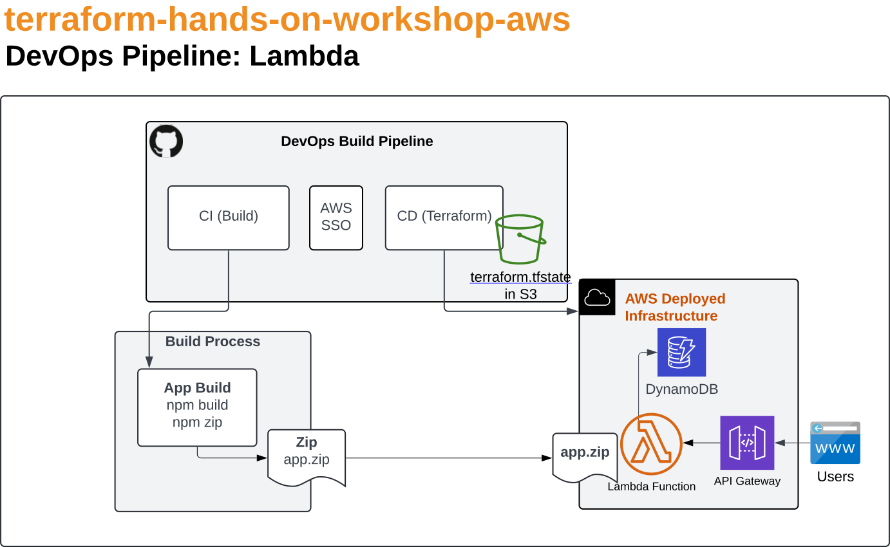
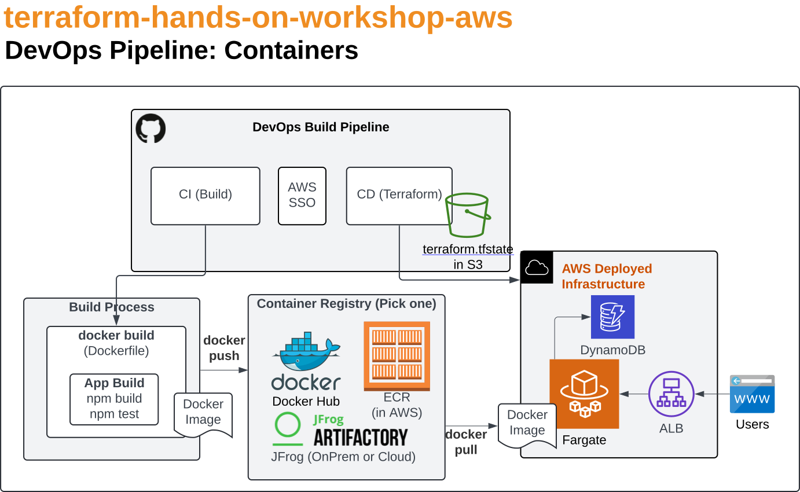
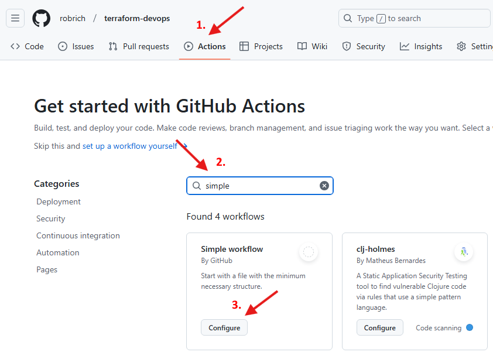
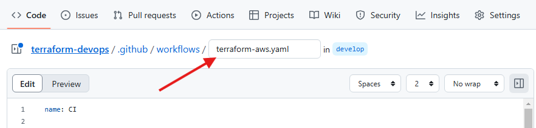
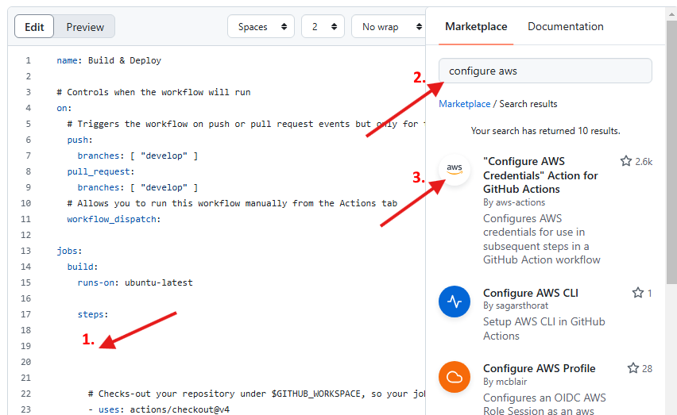
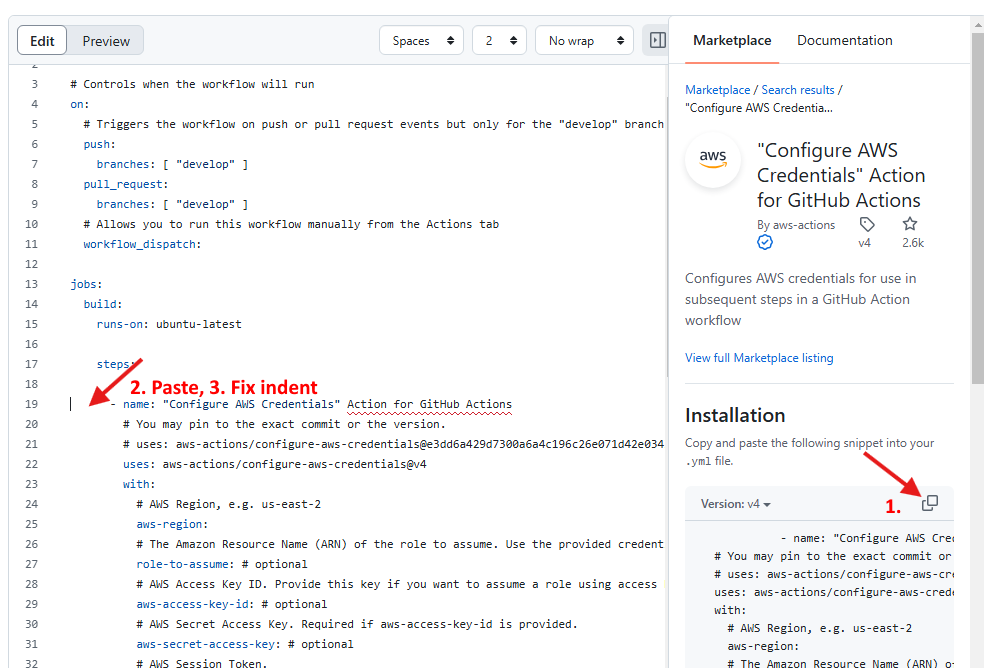
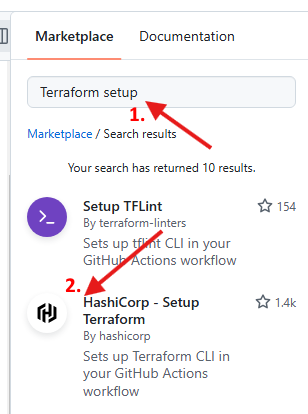
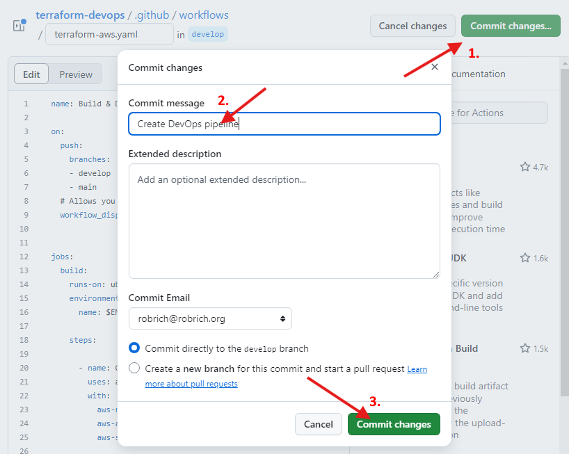

A DevOps Pipeline
=================


Introduction
------------

Our goal in this section is to:

1. Learn about cloud-based Terraform state files.

2. Learn the principles of automated builds.

3. Learn about [GitHub Actions](https://github.com/features/actions)

4. Provision the same solution using an automated build

> [!CAUTION]
> When you're done with this chapter, ensure you disable your cloud build and delete all cloud resources.  (See the last step below.)  Running AWS resources longer than necessary is expensive.


Setup
-----

If you haven't already, head to Chapter 0: Machine Setup and:

1. Ensure you have a GitHub account with privileges to

   - Create repositories
   - Create GitHub Actions builds
   - Create secrets

   If your corporate account doesn't give you these privileges, consider [creating a new, personal GitHub Account](https://docs.github.com/en/get-started/start-your-journey/creating-an-account-on-github)

2. Clone this repository into a convenient folder on your machine.


Cleanup
-------

If you haven't already, head to Chapter 5: Modules and:

1. Ensure you've deleted everything you created.  This chapter assumes it can create new ones.  If you create identically named things with a local Terraform state file and you will now create resources with a cloud-based state file, they may collide.


What we'll build
----------------

We'll start this chapter with the completed system we built in Chapter 4 and beyond.  In this chapter we'll move the state file to AWS S3, then setup an automated build to deploy the infrastructure on any code change.

Here's the architecture diagram of what we'll build:


- DynamoDB database
- Lambda function connects to the database
- API Gateway in front of the Lambda
- Fargate (ECS) container connects to the database
- ALB (Application Load Balancer) in front of the container

But unlike previous chapters, in this chapter we'll run it from an automated build.

Here's how we would build a Lambda:



Here's how we would build a container:



Unlike application CI/CD builds, this build will be stateful.  We need to keep track of what we deployed last time so we can alter it to the current needs.  To do this we need to keep track of the previous runs.  We'll keep this state file in an S3 bucket that only the build will use.

We also need to lock the state file when we're making changes so two simultaneous builds don't create duplicate resources.  We'll keep this lock flag in a DynamoDB table.

Let's build it!


Create Cloud Resources for Terraform State File storage
-------------------------------------------------------

> [!WARNING]
> Ensure you've deleted any previously deployed cloud resources.  We aren't going to move the state file, we're going to create a new one.  If there's any identically named cloud resources in your AWS account, the automated build will fail.

We'll put the state file and lock file in S3.  See the official docs at https://developer.hashicorp.com/terraform/language/backend/s3

> [!NOTE]
> In Terraform 1.10, `use_lockfile` was added, removing the need for storing locking in DynamoDB.

We have a bit of a chicken-n-egg scenario here.  We need an S3 bucket to keep our Terraform state file.  Ideally we'd use Terraform to create the S3 bucket.  But where do we keep the state file for creating the place to keep the state file?  We'd need to provision the S3 bucket first before we'd be able to provision the S3 bucket.  To avoid this race condition, we'll create the S3 bucket and IAM user manually.

- an S3 bucket
- a `client_id` and `client_secret`


### Create an S3 bucket

1. Login to the AWS website at https://aws.amazon.com/ using your username and password or your SSO option of choice.

2. On the very top-right, ensure you're in the AWS region you expect.

3. In the very top-left, in the search box type `S3` and navigate to S3: Scalable Storage in the Cloud.

4. Click the `Create bucket` button and use these options:

   - In the General configuration section set `Bucket name` to a unique name such as `github-actions-terraform-YOUR_NAME`

     **NOTE**: S3 bucket names must be globally unique across all AWS accounts and all regions.  It is quite likely a common name is already taken.

   - In the Bucket Versioning section set `Bucket Versioning` to `Enable`

5. Scroll to the very bottom and on the bottom-right click `Create bucket`.


### Create a Build User in AWS

1. If not already, login to the AWS website at https://aws.amazon.com/.

2. In the very top-left, in the search box, type `IAM` and navigate to the Identity Access Management (IAM) page.

3. On the far-left, switch to the `Users` page.

4. On the the top-right click `Create user`:

   - Set `username` to `github-actions`

   - Leave the `Provide access to AWS Console` option unchecked (the default).

5. Click next, and in the Set permissions page:

   - In the `Permissions Options`, choose `Attach policies directly`.

   - In the list, choose `AdministratorAccess`.

     **WARNING**: This is definitely not a security best practice, but this eliminates permission errors during this workshop.

   - Finish creating the user.

6. Click on the `github-actions` user to open the details page.

7. On the top-right, choose `Create access key`.

   - `Use case` is `Command Line Interface (CLI)`

   - In the `Description` enter `terraform-training`

7. Copy or download the Access Key and Secret.

   **IMPORTANT**: These will only be shown once.  If you lose these keys, you must create a new one.

Now that we've provisioned an S3 bucket and a build user, let's add this configuration to Terraform.


Change the AWS Terraform Provider
---------------------------------

See the official docs at https://developer.hashicorp.com/terraform/language/backend/s3

1. Open File Explorer in `06-DevOps-Pipeline/start` and create a new folder `terraform`.

2. Copy all the files from `04-AWS-Terraform/start/terraform` into this new `06-DevOps-Pipeline/start/terraform` folder.

3. Delete all the Terraform state files:

  - `.terraform`
  - `.terraform.lock.hcl`
  - `terraform.tfstate`
  - `terraform.tfstate.backup`

4. In the `04-AWS-Terraform/start/terraform` folder open `providers.tf` in your editor of choice.

5. Change to `backend "s3"`:

   Old:

   ```terraform
     backend "local" {
     }
   ```

   New:

   ```terraform
     backend "s3" {
     }
   ```

   **Note**: We'll use Terraform init `-backend-config` parameters to set all the values for this backend.  That'll keep sensitive information out of source control.  See https://developer.hashicorp.com/terraform/language/backend/s3#credentials-and-shared-configuration

6. Modify `vars.tf` and `input.tfvars` to include these new variables.

7. This works great for the cloud build we'll create.  But what if we want to test this locally?  We definitely don't want a local experiment to modify the state file in S3.  Let's build a local override.

   Create a new file in the `terraform` folder named `providers_override.example.tf` and add this content:

   ```terraform
   # copy this file to providers_override.tf to debug locally
   terraform {
     backend "local" {
     }
   }
   ```

   Now if we locally put this `*_override.tf` file in place, we'll use a local state file.  And the build can use the state file stored in S3.

   We'll make sure to ignore `*_override.tf` to ensure the build doesn't accidentally try to deploy from a local state file.


Commit to Git and push to GitHub
--------------------------------

1. Let's grab the apps folders so we can rebuild the Lambda and container on each build.

   From the folder `02-Apps` copy both `container` and `lambda` into the `06-DevOps-Pipeline/start` folder.  The completed folder structure inside `06-DevOps-Pipeline/start` should look like this:

   - start
     - container
     - lambda
     - terraform

2. We need to add a .gitignore file so we don't accidentally check in local temp files.

   In the `06-DevOps-Pipeline/start` folder, create a file named `.gitignore` and add this content:

   ```
   # downloaded files
   node_modules
   # built files
   dist
   *.zip
   # temp files
   .DS_Store
   *.orig
   # user-specific files
   .terraform*
   *.tfstate*
   *override.tf
   package-lock.json
   # secrets
   .env
   ```

3. Let's add a Read-Me file into this folder as well.

   In the `06-DevOps-Pipeline/start` folder, create a file named `README.md` and add this content:

   ```markdown
   Terraform Workshop
   ==================

   This repository is the DevOps Pipeline that builds a Node.js container and AWS lambda, then deploys them through Terraform.

   This is part of the [Terraform Hands-on Workshop](https://github.com/robrich/terraform-hands-on-workshop-aws).

   License
   -------

   MIT
   ```

4. Now we're ready to commit this all to a Git repository and push it to GitHub.

   Open a new terminal window inside the `start` folder and run this:

    ```sh
    git init
    git checkout -b develop
    git add .
    git commit -m "Terraform Workshop"
    ```

5. Open a new browser window to https://github.com/ and login if not already.

6. On the very top-right, click your profile icon or name, and choose `profile` to switch to your page.

7. Click the `Repositories` tab to switch to this page.

8. On the top-right, click the `New` button.

9. Set the `Repository name` to a descriptive name such as `terraform-devops`.

10. Optional: set the Description to a descriptive message.

    ```txt
    Terraform Workshop: GitHub Actions build
    ```

11. Optional: Mark the module `Private` or `Public` according to your preferences.

12. Do **NOT** add a ~~README~~, ~~.gitignore~~ or ~~license~~.

13. Scroll down and on the bottom-right, click `Create repository`.

14. On the right, click the copy button to copy the GitHub repository URL.

15. In the terminal window inside the `start` folder, run this:

    ```sh
    git remote add origin https://github.com/YOUR_REPO_HERE
    ```

    Make sure to paste your GitHub repository URL into place.

16. In the terminal, run this:

    ```sh
    git push -u origin develop
    ```

17. In the browser for this GitHub repository, refresh the page, and verify you now have files in the repository.


GitHub Actions Build
--------------------

Now that we have all the source code in a GitHub Repository, it's time to craft the GitHub Actions automated build.

In this build, we'll want to do these steps:

- set environment variables
- install Terraform CLI and AWS CLI
- checkout the latest code
- build and test the Lambda
- build and test the Docker container
- To-do: push the container to an Elastic Container Registry
- run Terraform commands
- validate the site is online

Let's build it!

1. In a browser, open GitHub to the repository you created above.

2. On the top, click on the `Actions` link to switch to GitHub Actions.

   

3. Scroll through the list of templates and admire the options.  In our case we'll use none of them.

4. On the top-left, in the `Search workflows` box, type `simple` and hit enter.

5. In the `Simple workflow` search result, click the `Configure` button.

   This scaffolds out a sample GitHub Actions YAML file.

6. At the top, change the file name from ~~`blank.yml`~~ to `terraform-aws.yaml`.

   

7. Optional: You can remove any line that starts with `#`.  These are comments.

8. At the top, change the `name` line to `name: Build & Deploy`.

9. In the `on` (build triggers) section, remove the `pull_request` section and change the `push` section to include two branches:

   Old:

   ```yaml
   # Controls when the workflow will run
   on:
     # Triggers the workflow on push or pull request events but only for the "develop" branch
     push:
       branches: [ "develop" ]
     pull_request:
       branches: [ "develop" ]
     # Allows you to run this workflow manually from the Actions tab
     workflow_dispatch:
   ```

   New:

   ```yaml
   # Controls when the workflow will run
   on:
     push:
       branches:
       - develop
       - main
     # Allows you to run this workflow manually from the Actions tab
     workflow_dispatch:
   ```

10. After the `on` section and before the `steps` section, add these lines:

    ```yaml
    env:
      ENV_NAME: ${{ github.ref_name == 'main' && 'prod' || github.ref_name == 'develop' && 'dev' || 'unknown' }}
    ```

    We'll use this environment variable to tell Terraform what environment we're deploying to.  It follows these rules:

    - If the branch is `develop` deploy to the `dev` environment.
    - If the branch is `main` deploy to the `prod` environment.
    - If the branch is anything else deploy nowhere.

    This branch naming strategy is called [GitFlow](https://nvie.com/posts/a-successful-git-branching-model/), coined by Vincent Driessen.

11. In the `build` section, after `runs-on` and before `steps`, add these lines:

    ```yaml
         environment:
            name: ${{ github.ref_name == 'main' && 'prod' || github.ref_name == 'develop' && 'dev' || 'unknown' }}
    ```

    Yes, this logic is duplicated.  Sadly, `environment.name` requires static configuration, and there's no variable that gets it back out.  So yes, we must duplicate this logic.

12. Scroll down to the `steps` section, and add a few blank lines after `steps` and before `actions/checkout`.

13. On the right, in the `Marketplace` section, search for `configure aws`.

    

14. Choose the `Configure AWS Credentials` task.

15. On the far right, click the copy button.

16. In the blank space between `steps` and `actions/checkout`, set your cursor.

17. Paste the text into place

    

18. Modify the indenting until it matches other tasks and resolves as valid YAML.  I.E. the red squiggles go away.

19. Modify the `name` to remove the quotes

20. In the task definition, set these parameters:

    - `aws-region: ${{ vars.AWS_REGION }}`
    - `aws-access-key-id: ${{ secrets.AWS_ACCESS_KEY_ID }}`
    - `aws-secret-access-key: ${{ secrets.AWS_SECRET_ACCESS_KEY }}`

    Yes, we're referencing GitHub Actions secrets we haven't created yet.  We'll set these below.

21. Delete all the other parameters.  The final task definition looks like this:

    ```yaml
          - name: Configure AWS Credentials
            uses: aws-actions/configure-aws-credentials@v4
            with:
              aws-region: ${{ vars.AWS_REGION }}
              aws-access-key-id: ${{ secrets.AWS_ACCESS_KEY_ID }}
              aws-secret-access-key: ${{ secrets.AWS_SECRET_ACCESS_KEY }}
    ```

    Technically it picks up environment variables named exactly this automatically.  But specifying them explicitly will make it easier to discover and repair later.

22. With the AWS setup solved, let's configure the Terraform CLI.

    On the right, in the Marketplace section, click on `search results` to return to the list of tasks.

23. Search for `Terraform setup` and choose the HashiCorp Setup Terraform` task.

    

24. On the far-right, click the copy button and paste the task underneath the `configure-aws-credentials` task, and fix the indenting.

25. Set `terraform_wrapper` to `false`.

    The Terraform Wrapper repeats the commands for easy debugging.  Alas, it also destroys the JSON output from `terraform output`.

26. Optional: If you'd like to use your private modules, set the `cli_config_credentials_token` to `${{ secrets.TERRAFORM_REGISTRY_SECRET }}`.

27. Remove all other parameters.  The final task definition looks like this:

    Option 1: With the Terraform Registry secret:

    ```yaml
          - name: HashiCorp - Setup Terraform
            uses: hashicorp/setup-terraform@v2.0.3
            with:
               terraform_wrapper: false
               cli_config_credentials_token: ${{ secrets.TERRAFORM_REGISTRY_SECRET }}
    ```

    Option 2: Without the Terraform Registry secret:

    ```yaml
          - name: HashiCorp - Setup Terraform
            uses: hashicorp/setup-terraform@v2.0.3
            with:
              terraform_wrapper: false
    ```

    **Note**: `terraform_wrapper: false` is necessary to avoid polluting output with the command that's run.

28. Remove any excess whitespace after the Terraform task and before the Checkout task.

29. Delete the `Run a one-line script` task.

30. The balance of our build work will be done in the multi-line script task.

    We've setup:

    - ✔️ environment variables
    - ✔️ AWS
    - ✔️ Terraform
    - ✔️ checked out the code

    Now we need to

    - build and test the Lambda
    - build and test the Docker container
    - run Terraform commands
    - validate the site is online

31. Change the name of the task from ~~`Run a multi-line script`~~ to `Build & Deploy`.

32. Change the task definition to this:

    ```yaml
          - name: Build & Deploy
            run: |
              set -e # stop on error

              # Build the Lambda
              cd lambda
              npm install
              npm run build
              # TODO: npm run test
              npm run zip
              cd ..
              # now lambda zip file is in ./lambda/dist/terraform-lambda.zip
              ls -l ./lambda/dist

              # Build the Container
              cd container
              export CONTAINER_IMAGE=robrich/terraform-workshop-aws:latest
              # TODO: swap with your ECR registry
              #export CONTAINER_IMAGE=123456789012.dkr.ecr.us-east-1.amazonaws.com/terraform-workshop-aws:${{ github.sha }}
              docker build -t $CONTAINER_IMAGE .
              # TODO: push to your ECR container registry
              # docker push $CONTAINER_IMAGE
              cd ..
    ```

    We're essentially copying the build.sh files into this script.  We could also choose to run the build.sh commands instead.

    `set -e` is very similar to PowerShell's `$ErrorActionPreference = "Stop"`.  If any command exits with a non-0 status code, it immediately fails the build.

33. Continuing with this task, add these lines to run Terraform commands:

    ```sh
              cd terraform
              # Build terraform.tfvars file
              echo "tags = {" > terraform.tfvars
              echo "  \"project\" = \"terraform-workshop\"" >> terraform.tfvars
              echo "  \"env\"     = \"$ENV_NAME\"" >> terraform.tfvars
              echo "}" >> terraform.tfvars
              echo "ENV_NAME = \"$ENV_NAME\"" >> terraform.tfvars
              echo "LAMBDA_ZIP_FILE = \"../lambda/dist/terraform-lambda.zip\"" >> terraform.tfvars # relative to Terraform folder
              echo "CONTAINER_IMAGE = \"$CONTAINER_IMAGE\"" >> terraform.tfvars
              echo "AWS_REGION = \"${{ vars.AWS_REGION }}\"" >> terraform.tfvars
              cat terraform.tfvars

              terraform init -backend-config="bucket=${{ vars.TERRAFORM_S3_BUCKET }}" \
                             -backend-config="key=$ENV_NAME/terraform.tfstate" \
                             -backend-config="region=${{ vars.AWS_REGION }}" \
                             -backend-config="access_key=${{ secrets.AWS_ACCESS_KEY_ID }}" \
                             -backend-config="secret_key=${{ secrets.AWS_SECRET_ACCESS_KEY }}" \
                             -backend-config="encrypt=true" \
                             -backend-config="use_lockfile=true"
              terraform apply --auto-approve --var-file="terraform.tfvars"

              unset TF_LOG # disable terraform debug logs that interfere with terraform output
              terraform output -json > terraform_output.json

              cd ..
    ```

    We're building up the input.tfvars file so we can pass it into Terraform apply.  We could have also chosen to set the parameters as environment variables, prefixing `TF_VAR_` to the front of each.  See also https://developer.hashicorp.com/terraform/cli/config/environment-variables

    Note that we're passing S3 configuration details in through the `-backend-config` parameters.  This keeps secrets out of the Terraform files in source control.  See https://developer.hashicorp.com/terraform/language/backend/s3#credentials-and-shared-configuration

    The `terraform output` command can be really handy at using Terraform results in other tasks or in debugging built resources.  We'll also export this file as a build asset later.

34. Now let's check to see if the site is running.  Add these lines:

    ```sh
              export GATEWAY_URL="$(jq -r '.my_gateway_url.value' ./terraform/terraform_output.json)?id=1"
              echo "curl the lambda through the api gateway: $GATEWAY_URL"
              STATUSCODE=$(curl --silent --output /dev/stderr --write-out "%{http_code}" $GATEWAY_URL)
              if [ "$STATUSCODE" -ne 200 ]; then
                echo "curl lambda to $GATEWAY_URL failed with status code $STATUSCODE"
                exit "$STATUSCODE"
              fi

              export ALB_URL="$(jq -r '.alb_url.value' ./terraform/terraform_output.json)-1"
              echo "curl the fargate container through the ALB: $ALB_URL"
              STATUSCODE=$(curl --silent --output /dev/stderr --write-out "%{http_code}" $ALB_URL)
              if [ "$STATUSCODE" -ne 200 ]; then
                echo "curl fargate to $ALB_URL failed with status code $STATUSCODE"
                exit "$STATUSCODE"
              fi
    ```

    We reach into the terraform_output file using [`jq`](https://jqlang.org/), a great tool for querying and modifying JSON files.  We pick out `my_gateway_url` for the API Gateway in front of the Lambda, and we pick out `alb_url` for the ALB in front of Fargate.  Then we `curl`, outputing only the HTTP status code.  If we don't get 200, we fail the build.

35. Next let's publish `terraform_output.json` as a build asset.

    On the right, switch back to the marketplace, and search for `Upload build artifact`.  Choose `Upload a build artifact by actions`, copy and paste the YAML into the bottom of the build, then fix the indenting.

36. Set the necessary parameters to grab the `terraform_output.json` file inside the `terraform` folder.

37. One additional parameter to set: [`if: always()`](https://docs.github.com/en/actions/writing-workflows/choosing-what-your-workflow-does/evaluate-expressions-in-workflows-and-actions#always)

    We don't want to only upload the file if all previous tasks succeed.  In fact uploading the file on a failed build may be critical for identifying why the build failed.

    **NOTE**: You could add `if: always()` filter to any task.  Or you could add `if: failure()` to notice a build is failing and begin rolling back.

38. That was a long walk, but we got there.  The build now does all our tasks:

    - ✔️ set environment variables
    - ✔️ AWS CLI setup
    - ✔️ Terraform CLI setup
    - ✔️ Get the latest code
    - ✔️ Build and test the Lambda
    - ✔️ Build and test the Docker container
    - ✔️ Run Terraform commands
    - ✔️ Validate the site is online

    **NOTE**: We can definitely augment this build with other tasks such as API tests, Cypress tests, BrowserStack tests, database migrations, and much, much more.  For now, this build is a good start.

39. On the top-right, click `Commit changes...`.

    

40. Optional: enter a descriptive message.

41. On the bottom-right, click `Commit changes`.

> [!WARNING]
> Because we've created a build file and changed the repository, we will kick off a build ... which will quickly **fail** ... because we haven't yet created the secrets this build references.


Git Pull
--------

The GitHub Actions build definition is a YAML file in your git repository.  We can continue editing it in our favorite editor.

1. Use your favorite Git tool to `git pull` this repository.

2. From the `start` folder notice the new file in this path: `.github/workflows/terraform-aws.yaml`.

3. Open this file in your favorite editor.


GitHub Secrets
--------------

Let's build the GitHub secrets used by this build.  See the official docs at https://docs.github.com/en/actions/security-for-github-actions/security-guides/using-secrets-in-github-actions

1. On the GitHub repository page, click on `Settings`.

2. On the left, click on `Environments`.

3. On the top-right, click on `New Environment`.

4. Set the name to `dev` and click `Configure environment`.

5. Scroll down to the `Environment secrets` section and click `Add environment secret`.

6. Set the `Name` to `AWS_ACCESS_KEY_ID` and set the `Value` to the AWS IAM user's AWS_ACCESS_KEY_ID created above.

   **FRAGILE**: Ensure the value doesn't have any leading or trailing spaces or an extra carriage return.  You want the value to be a single line of text.

7. Repeat this process of creating secrets for these other secrets:

   - `AWS_ACCESS_KEY_ID`: from AWS IAM user's access key
   - `AWS_SECRET_ACCESS_KEY`: from AWS IAM user's access key
   - Optional: `TERRAFORM_REGISTRY_SECRET`: from Terraform app in Module 5

8. Right under the secrets section in the `Environment variables` section click `Add environment variable` for each of these:

   - `AWS_REGION`: choose your region such as `us-east-1`
   - `TERRAFORM_S3_BUCKET`: the AWS S3 bucket name created above

   **Pro tip**: Secrets are for sensitive information.  In both GitHub's config screens and in the build log they will be converted to `***`.  Environment variables are for configuration details you don't want in the Git repository, but you are ok showing in settings screens and build logs.


Manually run a Build
--------------------

With the secrets in place, we can manually run the build

1. On the GitHub repository page, click on `Actions`.

2. On the left, click `Build & Deploy`, the build name.

3. On the top-right, click `Run Workflow` and choose the `develop` branch.

4. Refresh the page to see the new build run.

Did the build succeed?  Congratulations!  You've done very well.

Did the build fail?  Not to worry.  As we were building this course, the build failed more than 40 times before we got it right.  With each fail, we made subtle adjustments.  Take a look at the build output, Google the error message for clues, then make small adjustments.  If you're really stuck, diff the `start` and `done` folders and see if that helps find the typo.


Deploy to Production
--------------------

Because we're using GitFlow, we can easily deploy to multiple environments with the same build file.  We're using these GitFlow rules:

- develop branch deploys to dev environment
- main branch deploys to prod environment

Most everything is already setup.  Let's build the last few things and deploy a second environment in the same AWS account.

1. In a browser window on the GitHub repository page, choose `Settings`.

2. On the left, click `Environments`.

3. On the top-right, click `New environment`.

4. Name the environment `prod`, and click `Configure environment`.

5. In the prod environment page, scroll down to the `Environment secrets` section, click `Add environment secret`, and create secrets to match the `dev` environment created previously:

   - `AWS_ACCESS_KEY_ID`
   - `AWS_SECRET_ACCESS_KEY`
   - Optional: `TERRAFORM_REGISTRY_SECRET`

6. Repeat the process to create the environment variables:

   - `AWS_REGION`
   - `TERRAFORM_S3_BUCKET`

7. Open a terminal in the `start` folder and run this:

   ```sh
   git checkout -b main
   git push origin main
   ```

8. In the browser, on the GitHub repository page, click `Actions` and watch the new build.

9. In the browser, look through your AWS account at https://aws.amazon.com/ and see the new content created.  Note how it created new resources with a prod name and prod tags:

   - API Gateway
   - Lambda
   - DynamoDB
   - ALB
   - Fargate cluster

10. Since the `curl` command succeeded, we know this system is operational.

Did it succeed?  Congratulations!

Did it fail?  Since the `develop` branch build succeeded previously, it's probably a misconfigured secret or environment variable.  Make sure the case is correct and the values are set identically.


Bonus
-----

Did you finish the entire project and you're looking to level up?  Try these advanced challenges:

- Deploy production to a different AWS account

- Create an Elastic Container Registry, modify the build to push the Docker container to it, and configure Fargate to pull from it.


**IMPORTANT**: Destroy the infrastructure
-----------------------------------------

> [!CAUTION]
> It is **very** important to delete all the resources created today.  AWS continues to charge your account as long as these resources are running.  Ensure you've deleted all resources at the end of this chapter to save yourself money.  Let's delete all the resources.

Unlike previous chapters, let's use the build to destroy these resources.

1. Check out the `develop` branch.

2. Open `.github/workflows/terraform-aws.yaml`

3. After the last `fi` and before `name: Save terraform_output.json` add these lines:

   ```sh
              cd terraform
              terraform destroy --auto-approve --var-file="terraform.tfvars"
              cd ..
   ```

4. Commit and push the build file.

5. Merge this change into the `main` branch, and `git push origin main`.

> [!WARNING]
> The above technique assumes the build works.  If your build is failing, you may need to comment out other build steps to ensure you can run this.

If you can't get the build to automatically delete the resources, log into https://aws.amazon.com/ and delete the resources manually.  Look to Chapter 3: Click Ops's destroy section for instructions.
